# adrftools

## Introduction

*adrftools* contains functions to support effect estimation, inference,
and visualization with continuous (i.e., non-discrete) treatments. The
primary estimand with a continuous treatment is the average
dose-response function (ADRF), \\ \theta\_\text{ADRF}(a) = E\[Y(a)\]
\\where \\Y(a)\\ is the potential outcome under treatment value \\a\\
and \\E\[.\]\\ is the expectation operator, here taken over the
distribution of covariates \\X\\ in the population, where \\Y(a) =
h_a(X)\\ for some function \\h_a()\\. Unlike with categorical treatments
for which the treatment effect can be understood as a contrast between
expected potential outcomes under the fixed treatment levels, the effect
of a continuous treatment is a function, which makes interpreting it and
communicating it challenging. *adrftools* aims to simplify these tasks
while allowing for a rich understanding of the relationship being
studied.

When certain causal assumptions are met by the data and study design,
the ADRF can be identified as \\
E\[Y(a)\]=E_X\left\[E\[Y\|A=a,X\]\right\] \\Much of the effort in the
causal inference literature has been on finding consistent estimators of
this function. This is often quite challenging because in addition to
requiring knowledge of the relationship between \\X\\ and \\A\\ or
between \\X\\ and \\Y\\ (or both), it requires knowledge about the
relationship between \\A\\ and \\Y\\. With categorical treatments, this
latter relationship is direct. Popular methods for adjusting for \\X\\
in estimating the ADRF include weighting, g-computation, and
doubly-robust approaches. See Zhang et al.
([2016](#ref-zhangCausalInferenceQuantitative2016)) for a review of
these methods.

A full characterization of the ADRF can involve multiple steps. Often,
the ADRF does not correspond directly to a set of coefficients in the
outcome model. Rather, it must be computed for each treatment value from
the outcome model parameters using g-computation. This means simply
writing down the ADRF as a function of parameters is either impossible
or would fail to provide interpretable information about the effect of
treatment. There are a few solutions to this problem: one is to
visualize the ADRF in a plot. Another is to project a simpler function
onto the ADRF as a more interpretable summary; this strategy is
described in Neugebauer and Laan
([2007](#ref-neugebauerNonparametricCausalEffects2007)). *adrftools*
provides functionality for both of these strategies.

One may also want to perform inference on the ADRF to answer substantive
questions, such as whether the ADRF is flat, whether the ADRF is linear,
or whether the slope of a linear projection of the ADRF is nonzero.
Inference for the ADRF can be challenging, as multiple sources of
uncertainty must be accounted for, including sampling from the
population, estimation of weights to balance covariates, and estimation
of the outcome model parameters. *adrftools* offers methods to account
for this uncertainty when performing inference on the ADRF.

### Effect Curves

The ADRF is one of a variety of functions we call “effect curves”, which
are functions of the treatment. The following are the other effect
curves available in *adrftools*:

- A subgroup ADRF (where \\G\\ is a grouping variable and \\g\\ is a
  level of \\G\\): \\\theta\_{\text{ADRF},g}(a) =
  E\left\[Y(a)\|G=g\right\]\\
- The average marginal effect function (AMEF), defined as the derivative
  of the ADRF: \\\theta\_\text{AMEF}(a) =
  \frac{d\theta\_\text{ADRF}(a_0)}{da_0}\Bigr\|\_{a_0 = a}\\
- The reference effect curve, defined as the contrast between each point
  on an effect curve (\\\theta(a)\\) and a given (fixed) value on that
  curve (\\\theta(a')\\): \\\theta\_\text{ref}(a; a') = \theta(a) -
  \theta(a')\\
- The effect curve contrast, defined as the contrast between effect
  curves computed within subgroups \\G=g_1\\ and \\G=g_2\\:
  \\\theta\_\text{contr}(a; g_1, g_2) = \theta\_{g_1}(a) -
  \theta\_{g_2}(a)\\

All of these are linear functions of the ADRF, which means if we can
account for uncertainty in the ADRF, we can account for uncertainty in
the effect curves derived from it.

### This Guide

In this guide, we will walk through a standard analysis, demonstrating
how we can use *adrftools* to perform the tasks above. First we’ll load
*adrftools* using [`library()`](https://rdrr.io/r/base/library.html).

``` r
library(adrftools)
```

In what follows, we’ll describe the dataset used in this tutorial and
the help files of the package functions. Next, we’ll describe the basics
of the package as it is used to construct, visualize, and perform
inference on the ADRF. Next we’ll discuss other effect curves, and
finally other scenarios that require special attention (non-continuous
outcome, multiply imputed data, and sampling and balancing weights).

## The Data

The data we use in this guide is the `nhanes3lead` dataset that comes
with *adrftools*. This data is a subset of the NHANES III survey. We
will estimate and characterize the effect of blood lead levels on
cognitive test scores, adjusting for potential confounders.

``` r
data("nhanes3lead")

head(nhanes3lead)
#>         Age Male     Race   PIR Enough_Food Smoke_in_Home Smoke_Pregnant NICU
#> 1 10.583333    0    White 1.266           1             0              0    0
#> 2  7.166667    0    Black 0.603           1             1              1    0
#> 3 11.916667    0 Hispanic 3.173           1             0              0    0
#> 4  6.583333    1    White 1.543           1             1              0    0
#> 5  8.250000    0    White 3.043           1             0              0    0
#> 6  8.250000    1    Other 1.746           1             1              0    0
#>       logBLL Math Reading Block Digit   MEC_wt
#> 1 -0.3566749   10       8    12     7  7785.67
#> 2  2.0014800   13       9     8    12 11001.98
#> 3  1.3609766    6      10    11     7  7024.62
#> 4  1.1631508    6       5     8     5  7901.41
#> 5  0.7419373    8       9    14     8  9997.87
#> 6  1.3609766   12      10    11     8 11979.76
```

The treatment variables is `logBLL`, the natural log of blood lead
levels in μg/dL, and for this analysis, we will use `Math` as the
outcome variable, which is the score on the WISC Math test. Covariates
include `Age`, `Male`, `Race`, `PIR`, `Enough_Food`, `Smoke_in_Home`,
`Smoke_Pregnant`, and `NICU`.

## Analysis

We will use g-computation to estimate the ADRF of `logBLL` on `Math`
adjusting for the covariates. It is also possible to use weighted
g-computation or propensity score weighting alone to adjust for the
covariates; we will demonstrate those in the section “Additional
Scenarios”. The procedure for these is essentially the same.

We will use *adrftools* to answer the following research questions:

- What does the ADRF look like?
- Is the ADRF flat?
- Is the ADRF linear?
- What is the linear projection of the ADRF? Is its slope zero?
- What is the expected difference in Math scores under a low and high
  level of blood lead exposure?

### Fitting the outcome model

The first step is to fit the outcome model. This model is not to be
interpreted and should flexible enough to capture nonlinear
relationships, especially between the treatment and the outcome.
*adrftools* supports any model also supported by *marginaleffects*, but
performance is improved with models fit with
[`lm()`](https://rdrr.io/r/stats/lm.html) or
[`glm()`](https://rdrr.io/r/stats/glm.html).

Below, we use [`lm()`](https://rdrr.io/r/stats/lm.html) to fit a linear
regression of `Math` on `logBLL`, the covariates, and their interaction.
We will supply `logBLL` as a natural cubic spline with 5 degrees of
freedom to capture potential nonlinearities using
[`splines::ns()`](https://rdrr.io/r/splines/ns.html). We will also allow
the full ADRF to vary across levels of `Male` to allow us to examine sex
differences later.

``` r
library(splines)

fit <- lm(Math ~ ns(logBLL, df = 5) * Male *
            (Age + Race + PIR + Enough_Food + Smoke_in_Home +
               Smoke_Pregnant + NICU),
          data = nhanes3lead)
```

We won’t even look at this model; none of its coefficients are
interpretable. Instead, we’ll use functions in *adrftools* to
characterize the ADRF and perform inference on it.

### Computing and plotting the ADRF

To compute the ADRF, we supply the outcome model to
[`adrf()`](https://ngreifer.github.io/adrftools/reference/adrf.md),
which also requires the name of the treatment to be supplied to `treat`.

``` r
adrf_bll <- adrf(fit, treat = "logBLL")
```

The ADRF is only evaluated for a range of treatment values. That range
can be controlled by the `range` argument to
[`adrf()`](https://ngreifer.github.io/adrftools/reference/adrf.md). By
default, the range is the middle 95% of treatment values, which in the
case corresponds to values from -0.3567 to 2.4248. It is important to
know this range because all inferences made generalize only to treatment
values in this range. Typically, values on the edges of the observed
treatment range are estimated with less certainty, and values beyond the
observed treatment range involve extrapolation.

[`adrf()`](https://ngreifer.github.io/adrftools/reference/adrf.md) also
provides options for uncertainty estimation using the `vcov` argument.
The default, `vcov = "unconditional"`, uses M-estimation to account for
uncertainty in estimation and sampling analytically as described by
Hansen and Overgaard ([2024](#ref-hansenVarianceEstimationAverage2024));
this requires the model object to have `estfun()` and `bread()` methods.
Setting `vcov = "boot"` or `vcov = "fwb"` use the traditional or
fractional weighted bootstrap ([Xu et al. 2020](#ref-xu2020)),
respectively, as implemented in *fwb*; these both also account for
sampling and estimation uncertainty. Finally, any argument to the `vcov`
argument of `marginaleffects::vcov()` can be supplied to perform
conditional inference (i.e., treating the sample as fixed); the
“default” variance can be requested by setting `vcov = "conditional"`
(which typically just uses the
[`vcov()`](https://rdrr.io/r/stats/vcov.html) method for the model
object).

The output of
[`adrf()`](https://ngreifer.github.io/adrftools/reference/adrf.md) is an
`effect_curve` object. Printing the object displays some information
about the effect curve.

``` r
adrf_bll
#> An effect_curve object
#> 
#>  - curve type: ADRF
#>  - response: Math
#>  - treatment: logBLL
#>    + range: -0.3567 to 2.4248
#>  - inference: unconditional
#> 
#> Use `plot()` (`?adrftools::plot.effect_curve()`) to plot the curve, `summary()` (`?adrftools::summary.effect_curve()`) to test the curve, or `{object}(values)` (`?adrftools::effect_curve-class()`) to compute estimates.
```

An `effect_curve` object is a function that takes in values of the
treatment and returns estimates of the ADRF at those points. For
example, to display the ADRF estimates at values of `logBLL` equal to 0,
1, and 2, we can run the following:

``` r
adrf_bll(logBLL = c(0, 1, 2))
#>  ADRF Estimates
#> ────────────────
#>  logBLL Estimate
#>       0    8.421
#>       1    8.025
#>       2    7.146
#> ────────────────
```

Perhaps the most useful summary of an effect curve is its plot, which we
can produce simply by running
[`plot()`](https://rdrr.io/r/graphics/plot.default.html) on the
`effect_curve` object:

``` r
plot(adrf_bll)
```

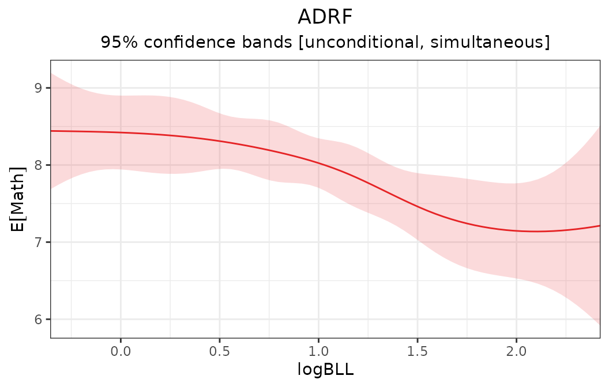

The x-axis is the treatment and the y-axis is the value of the ADRF at
the treatment level (labeled \\\text{E\[Math\]}\\). The solid red line
is the ADRF and the pink ribbon is the 95% uniform confidence band.

By default, confidence bands are computed providing uniform coverage,
meaning the nominal rate refers to simultaneous coverage of all points
on the line rather for a single given point ([Montiel Olea and
Plagborg-Møller 2019](#ref-montielolea2019)). Pointwise confidence bands
can instead be requested by setting `simultaneous = FALSE` in the call
to [`plot()`](https://rdrr.io/r/graphics/plot.default.html). This is
generally not recommended as it overstates the precision of the
estimated ADRF. The confidence level can be set with `conf_level`, and
if bootstrapping is used in
[`adrf()`](https://ngreifer.github.io/adrftools/reference/adrf.md), the
method of computing the confidence interval can be controlled by the
`ci.type` argument, which is passed to
[`fwb::summary.fwb()`](https://ngreifer.github.io/fwb/reference/summary.fwb.html).
Simultaneous coverage is only possible when `ci.type` is `"perc"`
(percentile confidence intervals, the default for bootstrapping) or
`"wald"`.

To compute confidence intervals around specific points of the ADRF, one
can use [`summary()`](https://rdrr.io/r/base/summary.html) on the output
of the `effect_curve` object:

``` r
adrf_bll(logBLL = c(0, 1, 2)) |>
  summary()
#>               ADRF Estimates
#> ──────────────────────────────────────────
#>  logBLL Estimate Std. Error CI Low CI High
#>       0    8.421     0.1678  8.021   8.822
#>       1    8.025     0.1124  7.757   8.293
#>       2    7.146     0.2162  6.630   7.661
#> ──────────────────────────────────────────
#> Inference: unconditional, simultaneous
#> Confidence level: 95% (t* = 2.386, df = 2401)
```

[`summary()`](https://rdrr.io/r/base/summary.html) accepts the same
arguments as [`plot()`](https://rdrr.io/r/graphics/plot.default.html) to
control the confidence interval coverage and whether inference is
simultaneous. Unlike with
[`plot()`](https://rdrr.io/r/graphics/plot.default.html), with
[`summary()`](https://rdrr.io/r/base/summary.html), simultaneous
inference only accounts for the estimates requested, not the full effect
curve.

Points along the ADRF can be contrasted pairwise using
[`point_contrast()`](https://ngreifer.github.io/adrftools/reference/point_contrast.md)
on the output of the `effect_curve` object (and then using
[`summary()`](https://rdrr.io/r/base/summary.html) on that output):

``` r
adrf_bll(logBLL = c(0, 1, 2)) |>
  point_contrast() |>
  summary()
#>                           ADRF Point Contrasts
#> ────────────────────────────────────────────────────────────────────────
#>                         Term Estimate Std. Error      t  P-value  CI Low
#>  [logBLL = 1] - [logBLL = 0]  -0.3964     0.2127 -1.863   0.1476 -0.8938
#>  [logBLL = 2] - [logBLL = 0]  -1.2757     0.2800 -4.556 < 0.0001 -1.9305
#>  [logBLL = 2] - [logBLL = 1]  -0.8793     0.2642 -3.328   0.0025 -1.4972
#> ────────────────────────────────────────────────────────────────────────
#> Inference: unconditional, simultaneous
#> Confidence level: 95% (t* = 2.338, df = 2401)
#> Null value: 0
```

In addition to the contrast estimates and confidence intervals, test
statistics and p-values for the tests that the contrasts are equal to 0
are displayed. The `Null value` note below the table indicates the null
value used for the tests.

### Testing the ADRF

To test omnibus hypotheses about the ADRF, such as whether it is flat or
linear, we can use [`summary()`](https://rdrr.io/r/base/summary.html) on
the `effect_curve` object itself, rather than on its output. In
particular, [`summary()`](https://rdrr.io/r/base/summary.html) tests
whether a given projection of the ADRF is sufficient to characterize it.
This projection is determined by the argument to `hypothesis`. By
default, this is `"flat"`, which tests that null hypothesis that the
ADRF is flat. If this hypothesis is rejected, this implies there is some
effect of the treatment.

``` r
summary(adrf_bll)
#>                   Omnibus Curve Test
#> ───────────────────────────────────────────────────────
#> H₀: ADRF is flat for values of logBLL between -0.3567
#>     and 2.4248
#> 
#>   P-value
#>  < 0.0001
#> ───────────────────────────────────────────────────────
#> Computed using the Imhof approximation
```

This test works in two steps: first, the projection \\\hat{P}(a)\\ is
computed, and second, the residuals of the projection are used to
compute the test statistic. The test statistic \\T\\ is defined as

\\ T=\int\_{a\_\text{low}}^{a\_\text{high}} {\left(\hat{\theta}(a) -
\hat{P}(a) \right)^2 da} \\

where \\\hat{\theta}(a)\\ is the ADRF estimate at treatment value \\a\\
and \\a\_\text{low}\\ and \\a\_\text{high}\\ are the lower and upper
bounds of the treatment domain, respectively. If the ADRF is perfectly
flat, \\T=0\\ because the difference between the ADRF and its flat
projection will be 0. It is possible to compute the cumulative
distribution function (CDF) of \\T\\ under the null hypothesis that the
true ADRF is equal to the specified projection, and that CDF is used to
compute the p-value along with the test statistic \\T\\ computed in the
sample.

There are several methods of approximating the CDF, and this choice is
controlled by the `method` argument to
[`summary()`](https://rdrr.io/r/base/summary.html):

1.  Monte Carlo simulation of the distribution of \\T\\ under the null
    hypothesis (`method = "sim"`)
2.  Analytic approximation using functionality in the *CompQuadForm*
    package (`method = "imhof"`, `"davies"`, or `"liu"`)
3.  Satterthwaite’s approximation based on moment matching to a
    \\\chi^2\\ distribution (`method = "satterthwaite"`)
4.  Kuonen’s saddlepoint approximation using functionality in the
    *survey* package (`method = "saddlepoint"`)

`method = "imhof"` and `method = "sim"` are the most reliable. The
former is fast and deterministic, and so is used by default when the
*CompQuadForm* package is installed. The latter is slower and subject to
Monte Carlo error, but does not require any additional packages.
`method = "saddlepoint"` performs well, too, and is used by default if
the *CompQuadForm* package is not installed but the *survey* package is.

`hypothesis` can also be `"linear"`, `"quadratic"`, `"cubic"`, or a
formula representing the projection to test. Rejecting the null
hypothesis indicates that the ADRF is more complicated than the supplied
model; for example, rejecting the null hypothesis for
`hypothesis = "linear"` means the ADRF is nonlinear, and failing to
reject the null hypothesis for for `hypothesis = "quadratic"` means
there is not enough evidence to claim the ADRF is more complicated than
a quadratic model. Rejecting any of these hypotheses also rejects the
null hypothesis for a lower-order model, including `"flat"`.

Finally, `hypothesis` can be a single number, indicating the null
hypothesis that the ADRF is flat and equal to that value. Typically,
this is more useful when testing other effect curves that have a natural
null value (e.g., 0).

In the example above, the p-value for the test that the ADRF is flat in
the range listed is less than .0001, so we can reject the null
hypothesis that the line is flat and therefore claim that there is an
effect of `logBLL` on `Math`. We can also test whether the ADRF is
approximately linear:

``` r
summary(adrf_bll, hypothesis = "linear")
#>                   Omnibus Curve Test
#> ───────────────────────────────────────────────────────
#> H₀: ADRF is linear for values of logBLL between
#>     -0.3567 and 2.4248
#> 
#>  P-value
#>    0.478
#> ───────────────────────────────────────────────────────
#> Computed using the Imhof approximation
```

In this case, the high p-value indicates that we cannot reject the null
hypothesis that the ADRF is linear, even though there appears to be a
curve in the plot. We can interpret this as indicating that a linear
ADRF is consistent with the data, or, more precisely, that there isn’t
evidence that the ADRF is nonlinear.

It’s important to only interpret these tests within the range listed in
the test output. It is possible for the ADRF to have a different shape
beyond this range, and it is possible that including a different range
could change the results of the test. For example, including parts of
the ADRF that are estimated with less precision can make the whole test
less precise.

### Estimating a linear projection

Though we have characterized, visualized, and tested the ADRF in a
flexible way, there may be use in finding a simpler representation of it
that can be used as a more interpretable summary. We were unable to
reject the null hypothesis that the ADRF is linear, so we can try
projecting the ADRF onto a linear model to more easily interpret its
form as a slope and intercept. This will also allow us to make a firmer
statement about the magnitude and direction of the effect of `logBLL` on
`Math`. We don’t need to re-fit the outcome model; the outcome model
does not correspond to the ADRF because it is a conditional model,
whereas the ADRF marginalizes over the distribution of covariates.
Instead, we can use
[`curve_projection()`](https://ngreifer.github.io/adrftools/reference/curve_projection.md)
to perform the projection.

[`curve_projection()`](https://ngreifer.github.io/adrftools/reference/curve_projection.md)
takes in an `effect_curve` object and a projection model that includes
only the treatment. This model can be in any form, but in this case, it
makes sense to supply a simple linear model. Any value that can be
supplied to `hypothesis` in
[`summary()`](https://rdrr.io/r/base/summary.html) can be supplied to
the `model` argument of
[`curve_projection()`](https://ngreifer.github.io/adrftools/reference/curve_projection.md),
which essentially fits a linear regression of the effect curve estimates
on the treatment values and correctly accounts for the uncertainty in
the effect curve estimates for estimating the uncertainty of the
projection model parameters. The projection is formed by minimizing the
loss function

\\
\int\_{a\_\text{low}}^{a\_\text{high}}{\left(\hat{\theta}(a)-\hat{P}(a)\right)^2
\\da} \\

where \\\hat{P}(a)\\ is the projection model evaluated at treatment
value \\a\\. When requesting a linear projection,

\\ \hat{P}(a)=\hat b_0 + \hat b_1 a \\

Below, we fit the linear projection using
[`curve_projection()`](https://ngreifer.github.io/adrftools/reference/curve_projection.md):

``` r
proj <- curve_projection(adrf_bll, "linear")

summary(proj)
#>                  ADRF Projection Coefficients
#> ──────────────────────────────────────────────────────────────
#>         Term Estimate Std. Error     t  P-value CI Low CI High
#>  (Intercept)    8.486     0.1322 64.18 < 0.0001  8.226   8.745
#>       logBLL   -0.613     0.1267 -4.84 < 0.0001 -0.861  -0.364
#> ──────────────────────────────────────────────────────────────
#> Inference: unconditional
#> Confidence level: 95% (t* = 1.961, df = 2401)
#> Null value: 0
```

The output of [`summary()`](https://rdrr.io/r/base/summary.html) is
similar to that when applied to an
[`lm()`](https://rdrr.io/r/stats/lm.html) object; we can see the
coefficient estimates, standard errors, tests, and confidence intervals.
As expected, we find a negative slope that is significant at the .001
level, indicating that a one-unit increase in `logBLL` corresponds to a
decrease in average `Math` scores.

We can plot the projection either alone or on top of the ADRF plot. To
plot it alone, we can simply use
[`plot()`](https://rdrr.io/r/graphics/plot.default.html) on the
[`curve_projection()`](https://ngreifer.github.io/adrftools/reference/curve_projection.md)
output:

``` r
plot(proj)
```

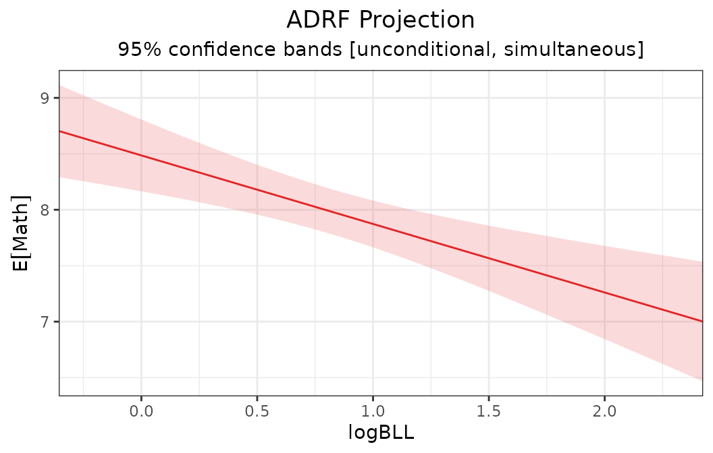

This plot is similar in interpretation to the ADRF plot.

To add the projection to the original estimated ADRF plot, we can supply
the
[`curve_projection()`](https://ngreifer.github.io/adrftools/reference/curve_projection.md)
output to the `proj` argument of
[`plot()`](https://rdrr.io/r/graphics/plot.default.html) applied to the
original `effect_curve` object:

``` r
plot(adrf_bll, proj = proj)
```

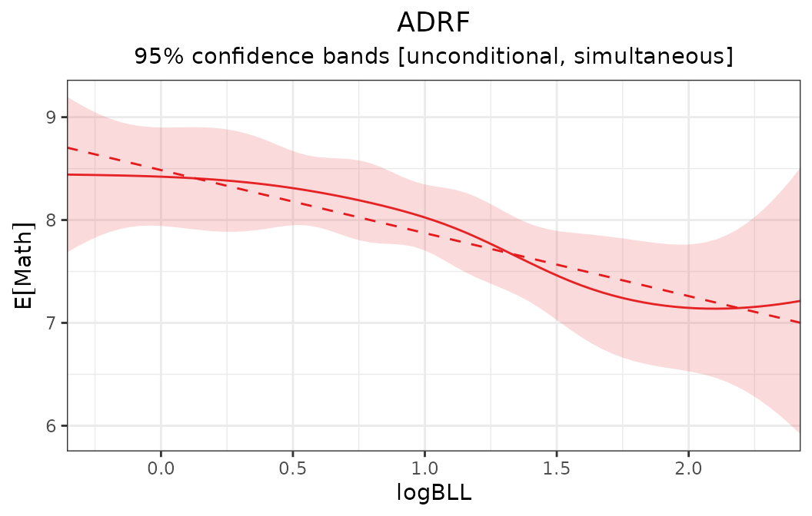

The dotted line is the projection, and the solid line and shaded region
correspond to the original ADRF estimate and the original ADRF
estimate’s confidence bands.

Two nested projection models can be compared with a Wald test using
[`anova()`](https://rdrr.io/r/stats/anova.html), just as for typical
linear models.

### Other effect curves

There is more to learn about the effect of the treatment on the outcome
than the ADRF alone can provide. Other effect curves help us answer
substantive questions about this effect. Below, we’ll describe computing
reference effect curves, the average marginal effect function (AMEF),
subgroup ADRFs, and contrasts between subgroup ADRFs. All these steps
use the ADRF as a building block.

#### Reference effect curves

A reference effect curve is a function representing the contrast between
the ADRF and the ADRF at a single level of the treatment. For example,
one may be interested in characterizing the effect of treatment as the
difference between the ADRF at nonzero treatment values and the ADRF
with treatment set to 0, as in Hill
([2011](#ref-hillBayesianNonparametricModeling2011)).

To compute a reference effect curve for the ADRF, we can supply the ADRF
to
[`reference_curve()`](https://ngreifer.github.io/adrftools/reference/reference_curve.md),
supplying an argument to `reference` corresponding to the level of the
treatment to use as the reference. Below, we set the reference to 0
(which is arbitrary in this example because the treatment is on a log
scale).

``` r
adrf_bll_ref <- reference_curve(adrf_bll, reference = 0)
```

This produces a `reference_curve` object, which, when printed, displays
the reference level.

``` r
adrf_bll_ref
#> An effect_curve object
#> 
#>  - curve type: ADRF reference
#>  - response: Math
#>  - treatment: logBLL
#>    + range: -0.3567 to 2.4248
#>  - reference level: 0
#>  - inference: unconditional
#> 
#> Use `plot()` (`?adrftools::plot.effect_curve()`) to plot the curve, `summary()` (`?adrftools::summary.effect_curve()`) to test the curve, or `{object}(values)` (`?adrftools::effect_curve-class()`) to compute estimates.
```

We can plot the reference curve, which will essentially be the original
ADRF shifted so that the curve height at the reference level is equal to
0.

``` r
plot(adrf_bll_ref)
```

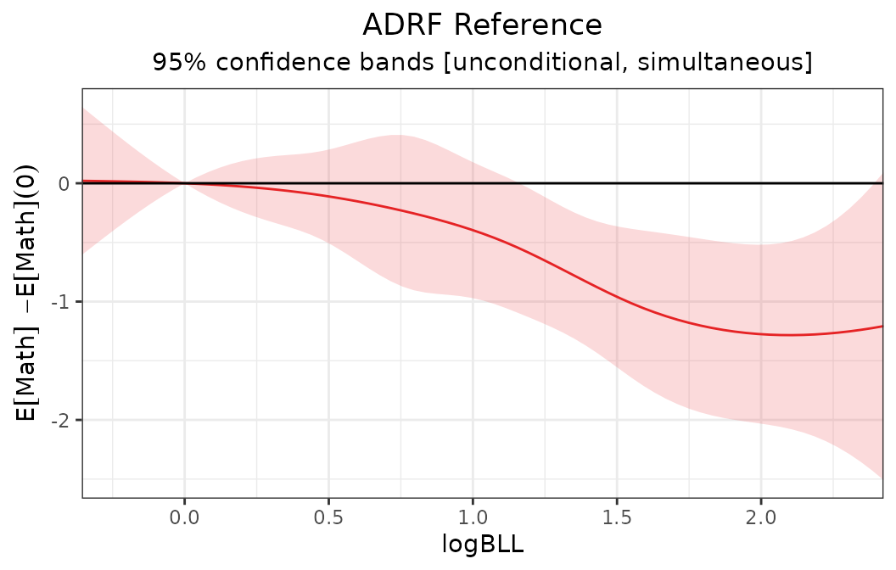

Notice that the confidence bands narrow close for treatment levels close
to the reference level; we have greater certainty about ADRF deviations
from the its value at the reference level in that region.

We can use [`summary()`](https://rdrr.io/r/base/summary.html) to test
whether the reference curve is equal to 0 everywhere, which tests
whether the ADRF differs from its value at the reference level:

``` r
summary(adrf_bll_ref)
#>                   Omnibus Curve Test
#> ───────────────────────────────────────────────────────
#> H₀: ADRF difference from reference (logBLL = 0) is 0
#>     for values of logBLL between -0.3567 and 2.4248
#> 
#>   P-value
#>  < 0.0001
#> ───────────────────────────────────────────────────────
#> Computed using the Imhof approximation
```

Theoretically, this is equivalent to testing whether the ADRF is flat
(no matter what the reference level is set to), though there may be
slight differences between the results of this test and those of the
test for flatness applied directly to the ADRF.

We can test whether individual values of the ADRF differ from the value
of the ADRF at the reference level by calling
[`summary()`](https://rdrr.io/r/base/summary.html) on the output of the
`reference_curve` object applied to the desired treatment levels:

``` r
adrf_bll_ref(logBLL = c(.5, 1, 1.5)) |>
  summary()
#>                  ADRF Reference Estimates
#> ───────────────────────────────────────────────────────────
#>  logBLL Estimate Std. Error      t  P-value  CI Low CI High
#>     0.5  -0.1113     0.1466 -0.760   0.7642 -0.4528  0.2301
#>     1.0  -0.3964     0.2127 -1.863   0.1452 -0.8918  0.0990
#>     1.5  -0.9598     0.2205 -4.354 < 0.0001 -1.4732 -0.4464
#> ───────────────────────────────────────────────────────────
#> Inference: unconditional, simultaneous
#> Confidence level: 95% (t* = 2.329, df = 2401)
#> Reference: logBLL = 0 | Null value: 0
```

From this output, we can see that the value of the ADRF at
`logBLL = 1.5` differs from that at `logBLL = 0` with a tiny p-value.
The note below the table indicates the value of the reference and the
null value for the hypothesis tests.

#### The AMEF

The AMEF is the derivative of the ADRF. Because it is a level of
abstraction away from the ADRF, it can be more challenging to interpret.
Each point on the AMEF represents the instantaneous effect of the
treatment on the outcome. Where the AMEF is 0, the ADRF is flat. In
*adrftools*,
[`amef()`](https://ngreifer.github.io/adrftools/reference/amef.md) can
be used to compute the AMEF by supplying to it an `adrf_curve` object.

``` r
amef_bll <- amef(adrf_bll)

amef_bll
#> An effect_curve object
#> 
#>  - curve type: AMEF
#>  - response: Math
#>  - treatment: logBLL
#>    + range: -0.3567 to 2.4248
#>  - inference: unconditional
#> 
#> Use `plot()` (`?adrftools::plot.effect_curve()`) to plot the curve, `summary()` (`?adrftools::summary.effect_curve()`) to test the curve, or `{object}(values)` (`?adrftools::effect_curve-class()`) to compute estimates.
```

The result is an `amef_curve` object, which, like all `effect_curve`
objects, is a function. We can plot the AMEF with
[`plot()`](https://rdrr.io/r/graphics/plot.default.html).

``` r
plot(amef_bll)
```

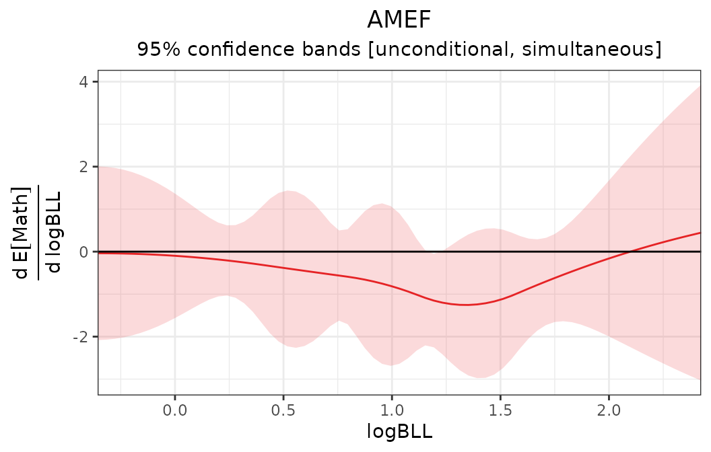

Unlike when plotting the ADRF, plotting the AMEF automatically includes
a horizontal line with a y-intercept of 0. This can be controlled with
the `null` argument to
[`plot()`](https://rdrr.io/r/graphics/plot.default.html).

We can compute estimates of the AMEF as specific values by supplying
those values to the `amef_curve` object and using
[`summary()`](https://rdrr.io/r/base/summary.html) to examine its
output:

``` r
amef_bll(c(0, 1, 2)) |>
  summary()
#>                       AMEF Estimates
#> ───────────────────────────────────────────────────────────
#>  logBLL Estimate Std. Error       t P-value  CI Low CI High
#>       0  -0.0982     0.5166 -0.1902  0.9965 -1.3313  1.1348
#>       1  -0.8166     0.6597 -1.2378  0.5133 -2.3911  0.7579
#>       2  -0.1605     0.6479 -0.2478  0.9923 -1.7068  1.3858
#> ───────────────────────────────────────────────────────────
#> Inference: unconditional, simultaneous
#> Confidence level: 95% (t* = 2.387, df = 2401)
#> Null value: 0
```

Here, a p-value for the test that the AMEF value is equal to 0 is
displayed along with confidence intervals. The null value for this test
can be controlled with the `null` argument to
[`summary()`](https://rdrr.io/r/base/summary.html).

Testing whether the AMEF is uniformly equal to 0 is theoretically
equivalent testing whether the ADRF is flat. We can perform this test
using [`summary()`](https://rdrr.io/r/base/summary.html) on the
`amef_curve` object itself. The default value for `hypothesis` is 0 to
test whether the AMEF is 0 everywhere.

``` r
summary(amef_bll)
#>                   Omnibus Curve Test
#> ───────────────────────────────────────────────────────
#> H₀: AMEF is 0 for values of logBLL between -0.3567 and
#>     2.4248
#> 
#>  P-value
#>   0.3528
#> ───────────────────────────────────────────────────────
#> Computed using the Imhof approximation
```

Conclusions from the test that the ADRF is flat and that the AMEF is 0
may differ due to differing sensitivities to local alternatives between
the tests. More research is needed to understand these differences. For
now, we recommend not using the test for the AMEF and instead testing
the flatness of the ADRF directly.

#### Subgroup ADRFs

The ADRF can be computed within subgroups to further probe the effect of
treatment for different unit profiles. To compute the ADRF in a
subgroup, one can simply use the `subset` argument to
[`adrf()`](https://ngreifer.github.io/adrftools/reference/adrf.md) as
one would in a call to [`lm()`](https://rdrr.io/r/stats/lm.html). The
supplied argument to `subset` should evaluate to a logical vector using
the data fit to the original model.

Below, we compute the ADRF of `logBLL` for the group `Male == 0`.

``` r
adrf_bll_male_0 <- adrf(fit, treat = "logBLL",
                        subset = Male == 0)
```

All functionality for full-sample ADRFs can be used with a subgroup
ADRF.

``` r
plot(adrf_bll_male_0)
```

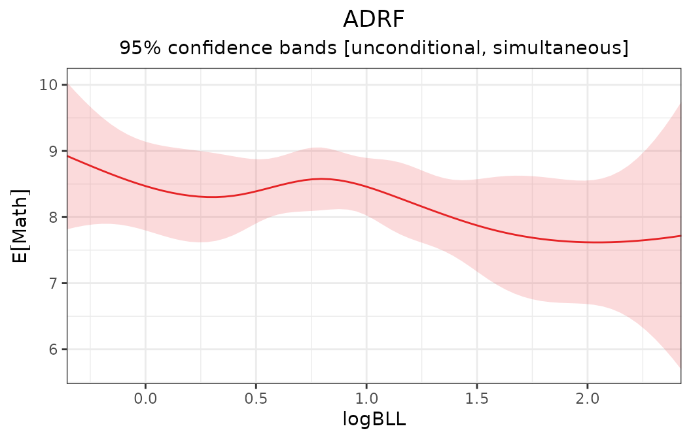

It’s also possible to compute the ADRF in multiple subgroups
simultaneously. To do so, one can use the `by` argument to
[`adrf()`](https://ngreifer.github.io/adrftools/reference/adrf.md),
which accepts a one-sided formula with the subgrouping variables on the
right side.

``` r
adrf_bll_by_male <- adrf(fit, treat = "logBLL",
                         by = ~Male)
```

Printing the stratified `adrf_curve` object displays which variables
were supplied to `by`:

When we plot the ADRF, we can see curves for both groups:

``` r
plot(adrf_bll_by_male)
```


Indeed, all functions that operate on the ADRF or its estimates produce
results for all subgroups. Below, we test the null hypotheses that the
ADRF for each subgroup is flat:

``` r
summary(adrf_bll_by_male)
#>                   Omnibus Curve Test
#> ───────────────────────────────────────────────────────
#> H₀: ADRF is flat for values of logBLL between -0.3567
#>     and 2.4248
#> 
#>  Male  P-value
#>     0   0.0667
#>     1 < 0.0001
#> ───────────────────────────────────────────────────────
#> Computed using the Imhof approximation
```

We can reject the null hypothesis for the `Male = 1` group, but not for
the `Male = 0` group at the .05 level.

We can display ADRF estimates for each subgroup by supplying values of
the treatment to the `adrf_curve` object and calling
[`summary()`](https://rdrr.io/r/base/summary.html) on its output:

``` r
adrf_bll_by_male(logBLL = c(0, 1, 2)) |>
  summary()
#>                 ADRF Estimates
#> ───────────────────────────────────────────────
#>  Male logBLL Estimate Std. Error CI Low CI High
#>     0      0    8.469     0.2351  7.850   9.088
#>     0      1    8.460     0.1523  8.059   8.861
#>     0      2    7.619     0.3274  6.757   8.480
#>     1      0    8.375     0.2392  7.746   9.005
#>     1      1    7.605     0.1641  7.173   8.036
#>     1      2    6.689     0.2833  5.943   7.434
#> ───────────────────────────────────────────────
#> Inference: unconditional, simultaneous
#> Confidence level: 95% (t* = 2.631, df = 2401)
```

Columns for the subgrouping variables are displayed on the left.

When we project the ADRFs onto a linear model, we also get separate
projection coefficients for each subgroup:

``` r
proj_by_male <- curve_projection(adrf_bll_by_male, "linear")

# Coefficient estimates
summary(proj_by_male)
#>                    ADRF Projection Coefficients
#> ───────────────────────────────────────────────────────────────────
#>  Male        Term Estimate Std. Error     t  P-value CI Low CI High
#>     0 (Intercept)    8.623     0.1867 46.18 < 0.0001  8.256   8.989
#>     0      logBLL   -0.441     0.1863 -2.37   0.0180 -0.806  -0.076
#>     1 (Intercept)    8.353     0.1871 44.65 < 0.0001  7.986   8.720
#>     1      logBLL   -0.779     0.1720 -4.53 < 0.0001 -1.116  -0.441
#> ───────────────────────────────────────────────────────────────────
#> Inference: unconditional
#> Confidence level: 95% (t* = 1.961, df = 2401)
#> Null value: 0

# Projection plot
plot(proj_by_male)
```


``` r

# ADRF plot with projection
plot(adrf_bll_by_male, proj = proj_by_male)
```

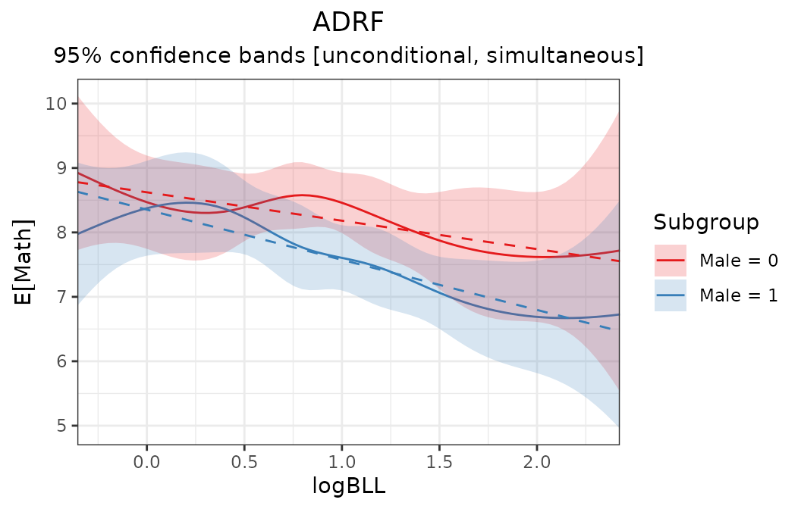

Note that any corrections for multiple comparisons when
`simultaneous = TRUE` in
[`plot()`](https://rdrr.io/r/graphics/plot.default.html) and
[`summary()`](https://rdrr.io/r/base/summary.html) will be made
accounting for all subgroups, which can quickly escalate with the
additional estimates within subgroups.

To display results for a subset of the subgroups,
[`plot()`](https://rdrr.io/r/graphics/plot.default.html), the
`adrf_curve` object, and
[`summary()`](https://rdrr.io/r/base/summary.html) all accept a `subset`
argument that works like that supplied to
[`adrf()`](https://ngreifer.github.io/adrftools/reference/adrf.md), but
it operates only on the subgroup estimates included in the `ardf_curve`
object by the `by` argument. For example, to plot each of the subgroups
separately, we can use the following:

#### 

- `Male = 0`
- `Male = 1`

``` r
plot(adrf_bll_by_male, subset = Male == 0) +
  ggplot2::coord_cartesian(ylim = c(5, 10), expand = FALSE)
```

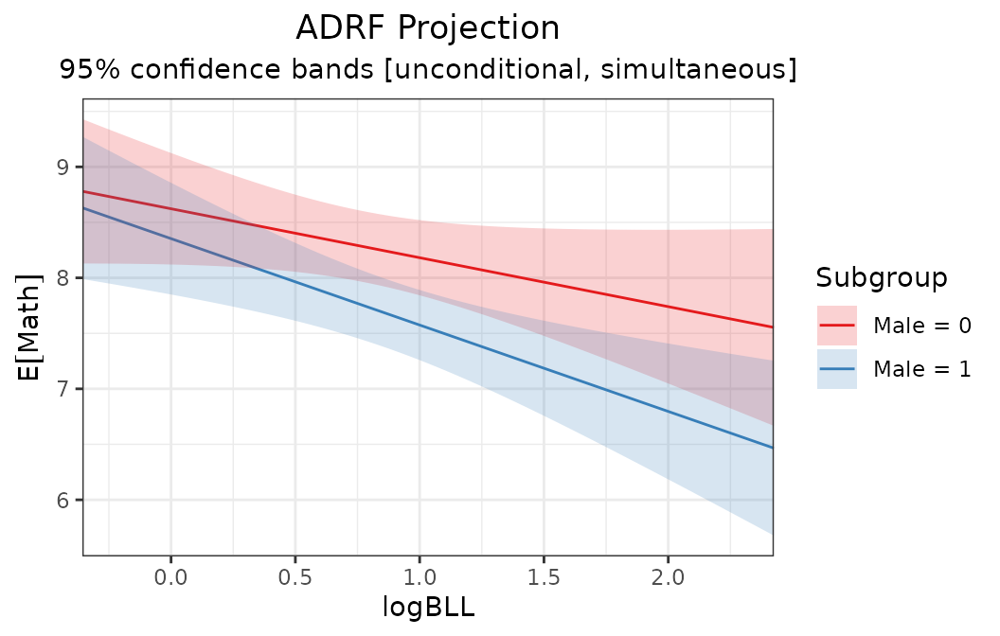

``` r
plot(adrf_bll_by_male, subset = Male == 1) +
  ggplot2::coord_cartesian(ylim = c(5, 10), expand = FALSE)
```

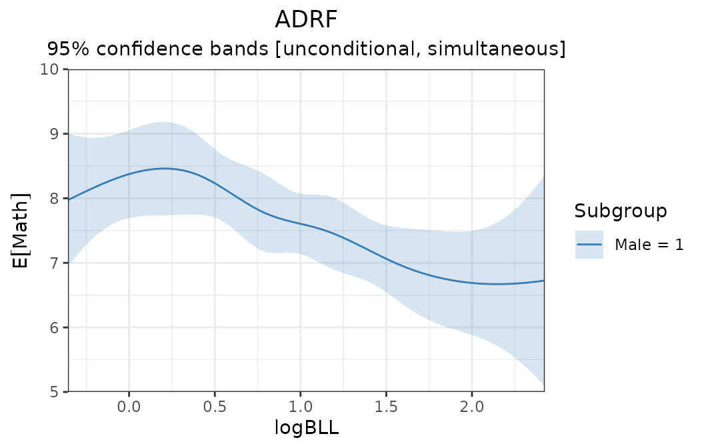

#### 

This produces the same output as plotting the ADRF computed by supplying
`subset` to
[`adrf()`](https://ngreifer.github.io/adrftools/reference/adrf.md) with
the same arguments. We can do the same with other functions as well:

#### 

- `Male = 0`
- `Male = 1`

``` r
# Testing whether the ADRF is flat
summary(adrf_bll_by_male, subset = Male == 0)
#>                   Omnibus Curve Test
#> ───────────────────────────────────────────────────────
#> H₀: ADRF is flat for values of logBLL between -0.3567
#>     and 2.4248
#> 
#>  Male P-value
#>     0  0.0667
#> ───────────────────────────────────────────────────────
#> Computed using the Imhof approximation

# Estimates along the ADRF
adrf_bll_by_male(logBLL = c(0, 1, 2), subset = Male == 0) |>
  summary()
#>                 ADRF Estimates
#> ───────────────────────────────────────────────
#>  Male logBLL Estimate Std. Error CI Low CI High
#>     0      0    8.469     0.2351  7.908   9.030
#>     0      1    8.460     0.1523  8.096   8.823
#>     0      2    7.619     0.3274  6.837   8.400
#> ───────────────────────────────────────────────
#> Inference: unconditional, simultaneous
#> Confidence level: 95% (t* = 2.386, df = 2401)
```

``` r
# Testing whether the ADRF is flat
summary(adrf_bll_by_male, subset = Male == 1)
#>                   Omnibus Curve Test
#> ───────────────────────────────────────────────────────
#> H₀: ADRF is flat for values of logBLL between -0.3567
#>     and 2.4248
#> 
#>  Male  P-value
#>     1 < 0.0001
#> ───────────────────────────────────────────────────────
#> Computed using the Imhof approximation

# Estimates along the ADRF
adrf_bll_by_male(logBLL = c(0, 1, 2), subset = Male == 1) |>
  summary()
#>                 ADRF Estimates
#> ───────────────────────────────────────────────
#>  Male logBLL Estimate Std. Error CI Low CI High
#>     1      0    8.375     0.2392  7.804   8.946
#>     1      1    7.605     0.1640  7.213   7.996
#>     1      2    6.689     0.2833  6.012   7.365
#> ───────────────────────────────────────────────
#> Inference: unconditional, simultaneous
#> Confidence level: 95% (t* = 2.386, df = 2401)
```

#### 

Notice the critical \\t\\ value (displayed as `t*` in the output)
differs when examining estimates within a subgroup and including both
subgroups because the adjustment to the value for simultaneous inference
is smaller with fewer estimates.

#### Subgroup ADRF contrasts

When `by` is used to compute the ADRF within subgroups, we compute a new
effect curve corresponding to the contrast between subgroup ADRFs. Using
[`curve_contrast()`](https://ngreifer.github.io/adrftools/reference/curve_contrast.md)
produces a `contrast_curve` object, which is an `effect_curve` object.

``` r
adrf_bll_male_contrast <- curve_contrast(adrf_bll_by_male)
```

Printing the object displays the contrast(s) computed. With more than
two subgroups, all pairs of subgroups are compared.

``` r
adrf_bll_male_contrast
#> An effect_curve object
#> 
#>  - curve type: ADRF contrast
#>  - response: Math
#>  - treatment: logBLL
#>    + range: -0.3567 to 2.4248
#>  - contrast: [Male = 1] - [Male = 0]
#>  - inference: unconditional
#> 
#> Use `plot()` (`?adrftools::plot.effect_curve()`) to plot the curve, `summary()` (`?adrftools::summary.effect_curve()`) to test the curve, or `{object}(values)` (`?adrftools::effect_curve-class()`) to compute estimates.
```

We can plot the difference between the two ADRFs using
[`plot()`](https://rdrr.io/r/graphics/plot.default.html):

``` r
plot(adrf_bll_male_contrast)
```

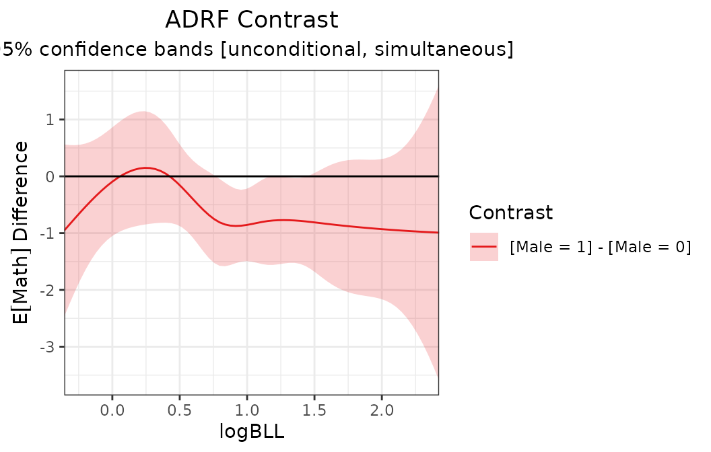

Here, the y-axis corresponds to the difference between the subgroup ADRF
estimates, and a horizontal line at 0 is displayed. We can use
[`summary()`](https://rdrr.io/r/base/summary.html) to test whether the
ADRF contrast curve is equal to 0 everywhere, which would indicate that
the ADRF does not differ across subgroups:

``` r
summary(adrf_bll_male_contrast)
#>                   Omnibus Curve Test
#> ───────────────────────────────────────────────────────
#> H₀: ADRF contrast is 0 for values of logBLL between
#>     -0.3567 and 2.4248
#> 
#>                 Contrast P-value
#>  [Male = 1] - [Male = 0]    0.01
#> ───────────────────────────────────────────────────────
#> Computed using the Imhof approximation
```

Given the small p-value, we can reject the null hypothesis that the ADRF
contrast is 0, implying the subgroup ADRFs differ from each other.

We can use [`summary()`](https://rdrr.io/r/base/summary.html) on the
output of the `contrast_curve` object to test for differences between
the subgroup ADRFs at specific points:

``` r
adrf_bll_male_contrast(logBLL = c(0, 1, 2)) |>
  summary()
#>                          ADRF Contrast Estimates
#> ──────────────────────────────────────────────────────────────────────────
#>                 Contrast logBLL Estimate Std. Error      t P-value  CI Low
#>  [Male = 1] - [Male = 0]      0  -0.0938     0.3354 -0.280  0.9890 -0.8942
#>  [Male = 1] - [Male = 0]      1  -0.8551     0.2239 -3.820  0.0004 -1.3892
#>  [Male = 1] - [Male = 0]      2  -0.9300     0.4329 -2.148  0.0914 -1.9631
#> ──────────────────────────────────────────────────────────────────────────
#> Inference: unconditional, simultaneous
#> Confidence level: 95% (t* = 2.386, df = 2401)
#> Null value: 0
```

Here we see evidence that the ADRF values at `logBLL = 1` differ between
the `Male = 1` and `Male = 0` subgroups.

## Additional Scenarios

Above, we demonstrated the basic use of *adrftools* with a linear
outcome model. Often, analyses are more complicated. For example, we
might be in a scenario with missing data, survey weights, inverse
probability weighting, nonlinear models, etc. Below, we briefly explain
how to modify the above procedures to deal with these issues.

### Nonlinear outcome models

If our outcome is binary, we may use a logistic regression to fit the
outcome model instead of a linear model. This adds an additional
complication because many of the procedures in *adrftools* assume
linearity of the quantities being analyzed. In general, though,
*adrftools* works smoothly with nonlinear models, such as generalized
linear models. Below, we demonstrate some of the differences when
dealing with such models.

For our outcome, we will use a binarized version of `Block`,
`Block_bin`, which is 1 if `Block` is 12 or greater and 0 otherwise.
We’ll create that variable below and use it as the outcome of our
outcome model:

``` r
nhanes3lead$Block_bin <- as.integer(nhanes3lead$Block >= 12)

table(nhanes3lead$Block_bin)
#> 
#>    0    1 
#> 2049  472

fit_bin <- glm(Block_bin ~ ns(logBLL, df = 5) *
                 (Age + Male + Race + PIR + Enough_Food + Smoke_in_Home +
                    Smoke_Pregnant + NICU),
               data = nhanes3lead,
               family = binomial)
```

To compute the ADRF, we simply call
[`adrf()`](https://ngreifer.github.io/adrftools/reference/adrf.md). We
can supply the `type` argument, which specifies the type of prediction
to use. The default, `type = "response"`, computes the ADRF on the
probability scale, which is the most natural for a binary outcome.

``` r
adrf_bll_bin <- adrf(fit_bin, treat = "logBLL")
```

We can plot the ADRF with
[`plot()`](https://rdrr.io/r/graphics/plot.default.html):

``` r
plot(adrf_bll_bin)
```

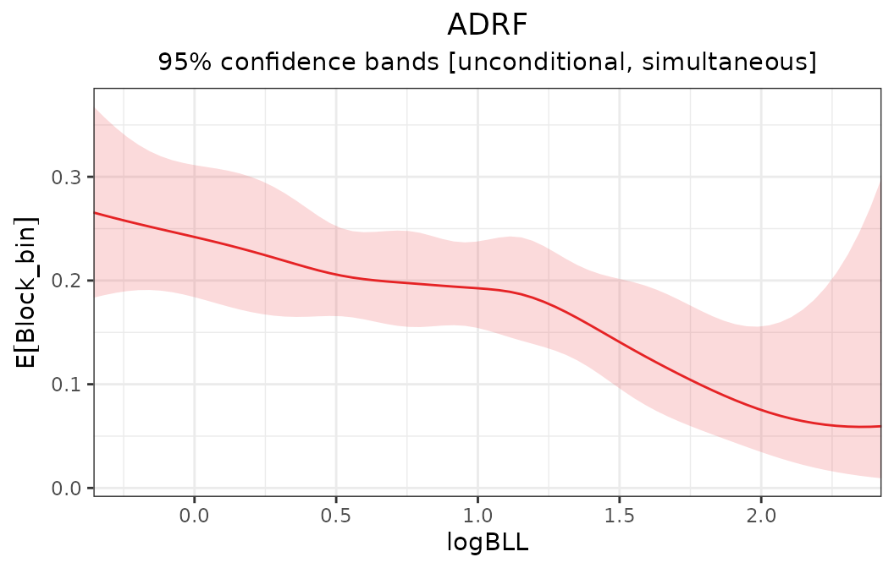

An important thing to notice is that the confidence bands are
asymmetrical. This is because symmetrical Wald confidence bands are
first computed on transformed versions of the ADRF estimates before
being back-transformed to be on the original scale. This isn’t the same
as computing the ADRF on the linear predictor of the outcome model
(i.e., by specifying `type = "link"` in the call to
[`adrf()`](https://ngreifer.github.io/adrftools/reference/adrf.md));
this involves computing the ADRF as usual on the original (probability
scale), transforming the ADRF estimates, using the delta method to
compute the variance of the transformed estimates, and then computing
Wald confidence bands using the variance of the transformed estimates
before back-transforming[¹](#fn1). This ensures the confidence bands
respect the bounds implied by the link function used in the outcome
model.

To instead compute symmetric confidence bands around the original ADRF
estimates, one can specify `transform = FALSE` to
[`plot()`](https://rdrr.io/r/graphics/plot.default.html). This produces
the same ADRF line, but the confidence bands will be symmetrical around
it, which means it is possible for the confidence bands to fall outside
0 and 1, as they do below:

#### 

- Transformed
- Untransformed

``` r
plot(adrf_bll_bin) +
  ggplot2::coord_cartesian(ylim = c(-.03, .37), expand = FALSE)
```

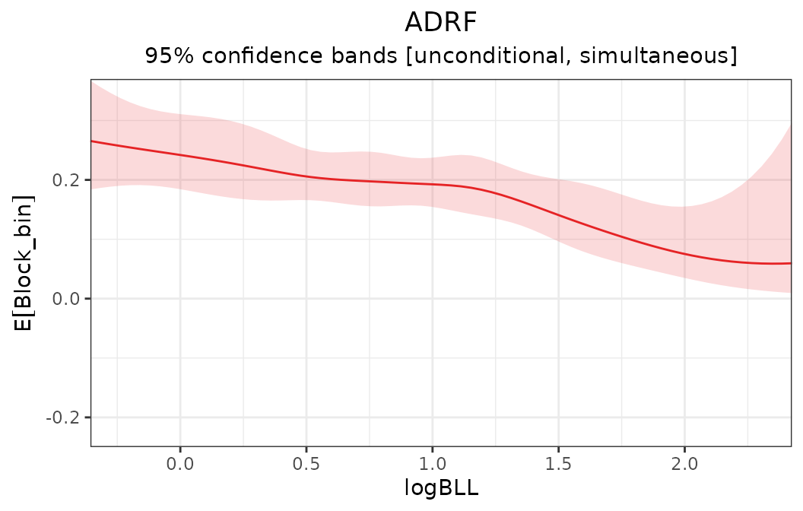

``` r
plot(adrf_bll_bin, transform = FALSE) +
  ggplot2::coord_cartesian(ylim = c(-.03, .37), expand = FALSE)
```

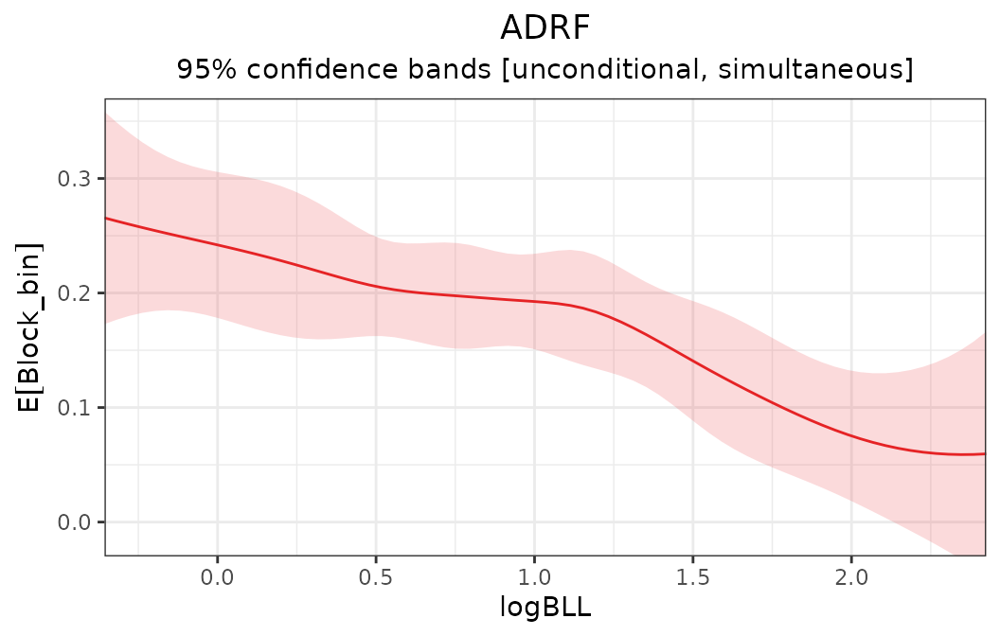

#### 

Bootstrapping and using a percentile confidence bands avoids this issue
because such bands are invariant to transformation and respect the
bounds of the outcome.

[`summary()`](https://rdrr.io/r/base/summary.html) applied to the ADRF
point estimates also has a `transform` argument for the same purpose; by
default, it computes transformed confidence intervals.

#### 

- Transformed
- Untransformed

``` r
adrf_bll_bin(logBLL = c(0, 1, 2)) |>
  summary()
#>         ADRF Estimates
#> ───────────────────────────────
#>  logBLL Estimate CI Low CI High
#>       0   0.2420 0.1930  0.2988
#>       1   0.1925 0.1602  0.2296
#>       2   0.0752 0.0396  0.1383
#> ───────────────────────────────
#> Inference: unconditional, simultaneous
#> Confidence level: 95% (z* = 2.386)
```

``` r
adrf_bll_bin(logBLL = c(0, 1, 2)) |>
  summary(transform = FALSE)
#>               ADRF Estimates
#> ──────────────────────────────────────────
#>  logBLL Estimate Std. Error CI Low CI High
#>       0   0.2420     0.0222 0.1890  0.2949
#>       1   0.1925     0.0145 0.1579  0.2272
#>       2   0.0752     0.0198 0.0279  0.1225
#> ──────────────────────────────────────────
#> Inference: unconditional, simultaneous
#> Confidence level: 95% (z* = 2.386)
```

#### 

When `transform = FALSE`, standard errors are displayed; otherwise, they
are omitted because the computed standard errors are on the transformed
estimates. Note that regardless of `transform`, all estimates and
confidence intervals are reported on the scale of the original
prediction type (in this case, probabilities). `transform` only changes
how the confidence intervals are computed.

`transform` can be `TRUE`, `FALSE`, a `family` object, or a function.
When `TRUE` (the default for all *adrftools* functions that use it), the
link function of the outcome model will be used. When a `family` object
is supplied, its link function will be used. When a function is
supplied, it will be used as the transformation. Typically a
transformation function takes in as input the estimate on the outcome
scale (e.g., probabilities for binary outcomes) and returns a quantity
on an unbounded scale; examples include
[`qlogis()`](https://rdrr.io/r/stats/Logistic.html) and
[`qnorm()`](https://rdrr.io/r/stats/Normal.html) for binary outcomes
(corresponding to logistic and probit links) and
[`log()`](https://rdrr.io/r/base/Log.html) for count outcomes.

When projecting the ADRF onto a simpler model, one has the option of
specifying the projection either as a transformation of the linear
predictor or as the linear predictor itself (i.e., untransformed). For
example, with a binary outcome and a logistic transformation, specifying
the projection as a transformation will yield a logistic (S-shaped)
curve, whereas specifying the projection as the linear predictor will
yield a straight line. For a transformation \\g(\mu)\\ with inverse
\\g^{-1}(\eta)\\ (e.g., \\g(\mu) = \log{\frac{\mu}{1-\mu}}\\ with
\\g^{-1}(\eta) = \frac{1}{1 + \exp(-\eta)}\\), the transformed
projection is estimated by minimizing

\\
\int\_{a\_\text{low}}^{a\_\text{high}}{\left(\hat{\theta}(a)-g^{-1}\left(\hat{P}(a)\right)\right)^2
\\da} \\

where \\\hat{P}(a)\\ is the linear predictor of the projection model
evaluated at treatment value \\a\\ (e.g., \\\hat{P}(a)=\hat{b}\_0 +
\hat{b}\_1 a\\ for a simple linear projection model). The projection is
estimated using nonlinear least-squares, with propagation of the
uncertainty in the ADRF carried through using the delta method.

The choice of whether to use a transformed projection or an
untransformed projection affects the output of
[`summary()`](https://rdrr.io/r/base/summary.html) and
[`curve_projection()`](https://ngreifer.github.io/adrftools/reference/curve_projection.md),
both of which involve a projection of the ADRF. When transformation is
requested with [`summary()`](https://rdrr.io/r/base/summary.html) (the
default), the null hypothesis tested is whether the ADRF is sufficiently
described by the transformed linear predictor. For example, consider a
scenario in which the true ADRF is S-shaped. Testing whether ADRF is
linear **without** transformation corresponds to testing whether the
ADRF is more complicated than a straight line, and therefore will likely
yield rejection of the null hypothesis (i.e., because a straight line is
not sufficient to characterize the S-shaped ADRF). Testing whether the
ADRF is linear **with** transformation corresponds to testing whether
the ADRF is more complicated than an S-shaped curve, and therefore will
likely yield a failure to reject the null hypothesis (i.e., because the
S-shaped curve is sufficient to characterize the ADRF). The correct
choice depends on the specifics of the research question and context.

When testing whether the ADRF is flat, the test using the transformed
linear predictor is typically equivalent to that using the linear
predictor itself; ideally these tests should yield the same conclusion.
When testing whether the ADRF is equal to a given value, the test
back-transforms the ADRF estimate and the given value before computing
the test statistic.

In the tabbed output below, we run
[`summary()`](https://rdrr.io/r/base/summary.html) and
[`curve_projection()`](https://ngreifer.github.io/adrftools/reference/curve_projection.md)
with and without transformation:

#### 

- Transformed
- Untransformed

``` r
# Test for flatness
summary(adrf_bll_bin)
#>                   Omnibus Curve Test
#> ───────────────────────────────────────────────────────
#> H₀: ADRF is flat (transformed) for values of logBLL
#>     between -0.3567 and 2.4248
#> 
#>   P-value
#>  < 0.0001
#> ───────────────────────────────────────────────────────
#> Computed using the Imhof approximation

# Test for linearity
summary(adrf_bll_bin, "linear")
#>                   Omnibus Curve Test
#> ───────────────────────────────────────────────────────
#> H₀: ADRF is linear (transformed) for values of logBLL
#>     between -0.3567 and 2.4248
#> 
#>  P-value
#>    0.144
#> ───────────────────────────────────────────────────────
#> Computed using the Imhof approximation

# Estimate projection on transformed ADRF
proj_t <- curve_projection(adrf_bll_bin, "linear")

summary(proj_t)
#>                   ADRF Projection Coefficients
#> ─────────────────────────────────────────────────────────────────
#>         Term Estimate Std. Error       z  P-value  CI Low CI High
#>  (Intercept)  -1.0964     0.0941 -11.653 < 0.0001 -1.2808  -0.912
#>       logBLL  -0.5373     0.0996  -5.392 < 0.0001 -0.7325  -0.342
#> ─────────────────────────────────────────────────────────────────
#> Inference: unconditional
#> Confidence level: 95% (z* = 1.96)
#> Null value: 0
```

``` r
# Test for flatness
summary(adrf_bll_bin, transform = FALSE)
#>                   Omnibus Curve Test
#> ───────────────────────────────────────────────────────
#> H₀: ADRF is flat for values of logBLL between -0.3567
#>     and 2.4248
#> 
#>   P-value
#>  < 0.0001
#> ───────────────────────────────────────────────────────
#> Computed using the Imhof approximation

# Test for linearity
summary(adrf_bll_bin, "linear", transform = FALSE)
#>                   Omnibus Curve Test
#> ───────────────────────────────────────────────────────
#> H₀: ADRF is linear for values of logBLL between
#>     -0.3567 and 2.4248
#> 
#>  P-value
#>   0.5193
#> ───────────────────────────────────────────────────────
#> Computed using the Imhof approximation

# Estimate projection on untransformed ADRF
proj_u <- curve_projection(adrf_bll_bin, "linear", transform = FALSE)

summary(proj_u)
#>                   ADRF Projection Coefficients
#> ────────────────────────────────────────────────────────────────
#>         Term Estimate Std. Error      z  P-value  CI Low CI High
#>  (Intercept)   0.2497     0.0162 15.396 < 0.0001  0.2179  0.2815
#>       logBLL  -0.0788     0.0133 -5.936 < 0.0001 -0.1048 -0.0528
#> ────────────────────────────────────────────────────────────────
#> Inference: unconditional
#> Confidence level: 95% (z* = 1.96)
#> Null value: 0
```

#### 

#### 

- Transformed
- Untransformed

``` r
# Plot transformed projection
plot(proj_t)
```

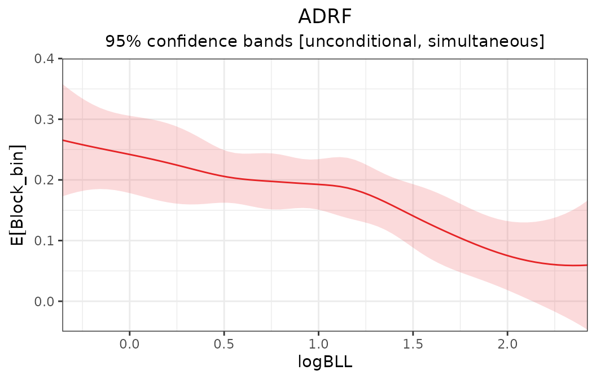

``` r

plot(adrf_bll_bin, proj = proj_t)
```


``` r
# Plot untransformed projection
plot(proj_u)
```

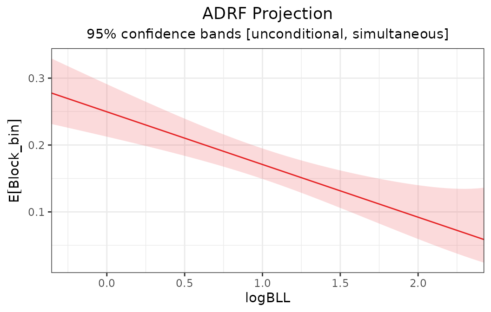

``` r

plot(adrf_bll_bin, proj = proj_u)
```

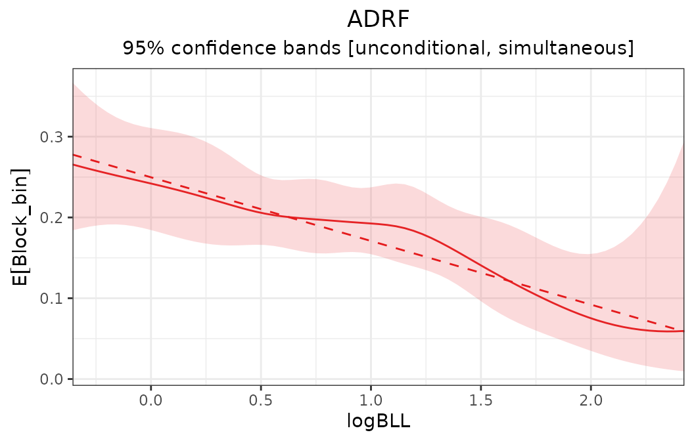

#### 

Notice that the projections appear someone different depending on
whether transformation is requested. If so (the default), the projection
coefficients are interpreted like those from a generalized linear model
of the outcome on the treatment with the transformation as the given
link function (in this case, on the log odds scale). The projection is
curved to reflect the nonlinear relationship implied by the
transformation. If not, the projection coefficients are interpreted
directly as though fitted with a linear model, and the projection is
linear. Transformed projections may be more realistic by respecting the
scale of the outcome, but their coefficients can be harder to interpret.

In the example above, the untransformed linear projection appear to fit
the ADRF slightly better; it would be reasonable to say that in the
observed treatment range, the ADRF can be sufficiently described as
linear. However, knowing that the outcome is bounded by 0 and 1, we know
the ADRF cannot be linear across the entirety of the real number line.

### Balancing weights

G-computation typically requires unlikely conditions to be met in order
to be effective at adjusting for confounding. Those conditions can be
weakened by first weighting the sample so that the treatment is
independent of the covariates. After weighting, one can either use
g-computation in the weighted sample or simply fit an unconditional
dose-response function without further adjusting for covariates, in
which case the estimated dose-response function corresponds to the ADRF.

*adrftools* can handle weighted samples in a straightforward way.
Nothing needs to change from the previous scenarios; the only issue to
be concerned about is the need to refit the weighting model when
bootstrapping for uncertainty estimation. Fortunately, functionality in
*WeightIt* makes this straightforward. If using *WeightIt* to estimate
weights, one can use one of *WeightIt*’s built-in outcome modeling
functions like
[`glm_weightit()`](https://ngreifer.github.io/WeightIt/reference/glm_weightit.html)
to fit the outcome model. See an example below, in which we first
estimate balancing weights using generalized propensity score weighting.

``` r
library(WeightIt)

w_fit <- weightit(logBLL ~ Male + Age + Race + PIR + Enough_Food +
                    Smoke_in_Home + Smoke_Pregnant + NICU,
                  data = nhanes3lead,
                  method = "glm")

w_fit
#> A weightit object
#>  - method: "glm" (propensity score weighting with GLM)
#>  - number of obs.: 2521
#>  - sampling weights: none
#>  - treatment: continuous
#>  - covariates: Male, Age, Race, PIR, Enough_Food, Smoke_in_Home, Smoke_Pregnant, NICU
```

Normally, we would assess balance on the weights, but we’ll skip that
here (see
[`vignette("cobalt", package = "cobalt")`](https://ngreifer.github.io/cobalt/articles/cobalt.html)
for details on how to do this). We’ll use
[`glm_weightit()`](https://ngreifer.github.io/WeightIt/reference/glm_weightit.html)
to fit a linear model for `Math`, incorporating the estimation of the
weights into the variance of the outcome model parameters.

``` r
fit <- glm_weightit(Math ~ ns(logBLL, df = 5) *
                      (Age + Male + Race + PIR + Enough_Food + Smoke_in_Home +
                         Smoke_Pregnant + NICU),
                    data = nhanes3lead,
                    weightit = w_fit)
```

Finally, we can use
[`adrf()`](https://ngreifer.github.io/adrftools/reference/adrf.md) to
compute the ADRF, just as we did with the output of
[`lm()`](https://rdrr.io/r/stats/lm.html).

``` r
adrf_bll_w <- adrf(fit, treat = "logBLL")

plot(adrf_bll_w)
```

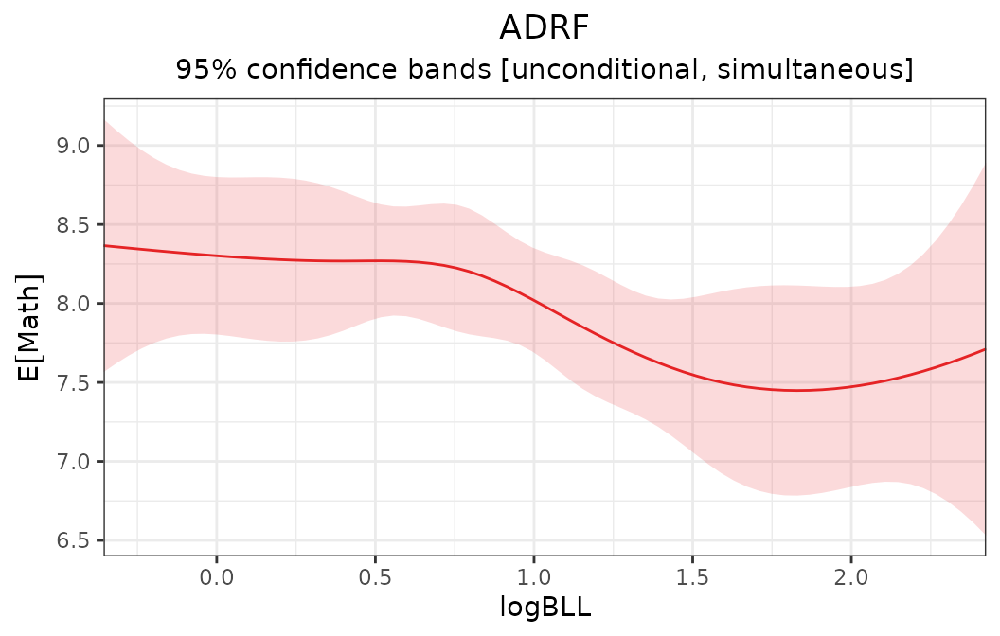

### Sampling weights

Sampling weights can be a bit more complicated than balancing weights;
in addition to using the weights to fit the outcome model, the sampling
weights need to be incorporated into the g-computation procedure to
estimate the ADRF. For outcome models fit with
[`survey::svyglm()`](https://rdrr.io/pkg/survey/man/svyglm.html), no
special operation is required—the sampling weights are automatically
incorporated into the estimation and variance estimates.

If sampling weights are used with another model or are not included in a
model, the `wts` argument to
[`adrf()`](https://ngreifer.github.io/adrftools/reference/adrf.md) needs
to be specified. `wts` can be `TRUE` to use the weights used to fit the
outcome model, a string containing the name of the variable in the
original dataset containing the sampling weights, or a vector of
sampling weights. In general, it’s best to use a model that
automatically incorporates the sampling weights; `wts` should typically
not be specified.

In the `nhanes3lead` dataset, the `MEC_wt` variable contains sampling
weights. Below, we’ll demonstrate three common approaches to
incorporating sampling weights: 1) using
[`survey::svyglm()`](https://rdrr.io/pkg/survey/man/svyglm.html), 2)
using the `s.weights` argument in
[`WeightIt::weightit()`](https://ngreifer.github.io/WeightIt/reference/weightit.html),
and 3) using the `weights` argument in
[`glm()`](https://rdrr.io/r/stats/glm.html); only the last of these
three requires using the the `wts` argument.

#### Using *survey*

First, we’ll use *survey* functionality to incorporate sampling weights.

``` r
library(survey)

des <- svydesign(~1, weights = ~MEC_wt, data = nhanes3lead)

fit_sv <- svyglm(Math ~ ns(logBLL, df = 5) *
                   (Age + Male + Race + PIR + Enough_Food + Smoke_in_Home +
                      Smoke_Pregnant + NICU),
                 design = des)
```

Simply calling
[`adrf()`](https://ngreifer.github.io/adrftools/reference/adrf.md)
automatically incorporates sampling weights.

``` r
adrf_sv <- adrf(fit_sv, treat = "logBLL")

plot(adrf_sv)
```

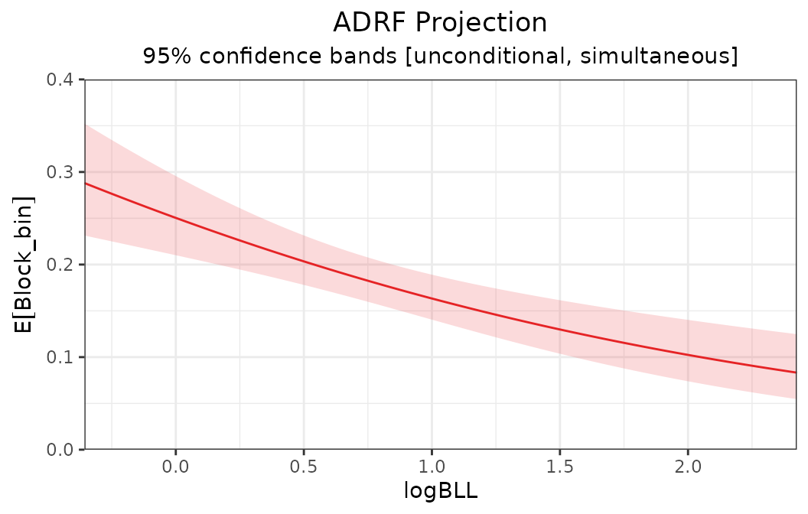

#### Using `glm()`

If the survey design is simple and can be captured using weights alone
(i.e., without stratification or clustering),
[`glm()`](https://rdrr.io/r/stats/glm.html) with the `weights` argument
can be used instead of
[`svyglm()`](https://rdrr.io/pkg/survey/man/svyglm.html). A special
standard error is required for the estimates to be valid, but
[`adrf()`](https://ngreifer.github.io/adrftools/reference/adrf.md)
calculates that standard error automatically when
`vcov = "unconditional"` (the default).

``` r
fit_gs <- glm(Math ~ ns(logBLL, df = 5) *
               (Age + Male + Race + PIR + Enough_Food + Smoke_in_Home +
                  Smoke_Pregnant + NICU),
             data = nhanes3lead,
             weights = MEC_wt)
```

With [`glm()`](https://rdrr.io/r/stats/glm.html), we need to set
`wts = TRUE` in the call to
[`adrf()`](https://ngreifer.github.io/adrftools/reference/adrf.md) to
ensure the weights are properly included in the ADRF estimation. If not,
the weights will be used only in fitting the outcome mode, but the ADRF
will generalize to the unweighted population. This is okay if the
weights are balancing weights, but if they are sampling weights, it is
critical for them to be incorporated into the ADRF as well.

``` r
adrf_gs <- adrf(fit_gs, treat = "logBLL",
                wts = TRUE)

plot(adrf_gs)
```

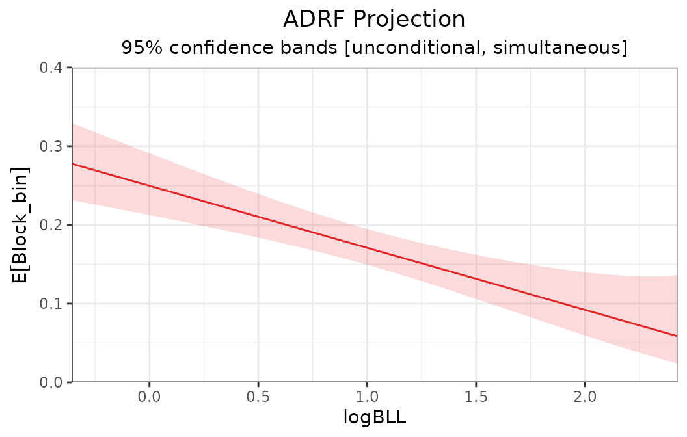

Using `wts = "MEC_wts"` would yield the same results and can be used if
the weights used to fit the outcome model are different from those used
to generalized the ADRF (as we will see below when combining sampling
and balancing weights).

#### Sampling weights and balancing weights together

If you want to use balancing weights in a sampling-weighted sample, some
additional considerations are required. Importantly, the product of the
sampling weights and balancing weights is used to fit the outcome model,
but the ADRF is computed incorporating the sampling weights alone. Doing
this with *WeightIt* is the most straightforward; simply supplying the
`s.weights` argument to
[`weightit()`](https://ngreifer.github.io/WeightIt/reference/weightit.html)
makes everything work as expected. They are automatically included in
the outcome model when fit with
[`glm_weightit()`](https://ngreifer.github.io/WeightIt/reference/glm_weightit.html)[²](#fn2).

``` r
library(WeightIt)

w_sw_fit <- weightit(logBLL ~ Male + Age + Race + PIR + Enough_Food +
                       Smoke_in_Home + Smoke_Pregnant + NICU,
                     data = nhanes3lead,
                     method = "glm",
                     s.weights = "MEC_wt")

fit_sw <- glm_weightit(Math ~ ns(logBLL, df = 5) *
                         (Age + Male + Race + PIR + Enough_Food + Smoke_in_Home +
                            Smoke_Pregnant + NICU),
                       data = nhanes3lead,
                       weightit = w_sw_fit)
```

By default,
[`adrf()`](https://ngreifer.github.io/adrftools/reference/adrf.md) uses
the sampling weights, but not the balancing weights, in standardizing
the ADRF estimate. This ensures the estimates generalize to the
sampling-weighted sample[³](#fn3).

``` r
adrf_sw <- adrf(fit_sw, treat = "logBLL")

plot(adrf_sw)
```


#### Other scenarios

In general, `wts` can accept one of a few arguments. Leaving it `NULL`,
as we did in two of the cases above, automatically includes the weights
in the estimation of the ADRF if the outcome model is fit using
[`svyglm()`](https://rdrr.io/pkg/survey/man/svyglm.html) or using
[`glm_weightit()`](https://ngreifer.github.io/WeightIt/reference/glm_weightit.html)
with `s.weights` supplied in the original call to
[`weightit()`](https://ngreifer.github.io/WeightIt/reference/weightit.html).
Otherwise, weights are not included. To use the same weights in the ADRF
that were used to fit the outcome model, set `wts = TRUE`, as we did in
the [`glm()`](https://rdrr.io/r/stats/glm.html) example above. To use a
set of weights in the ADRF different from those used to fit the outcome
model, supply the names of the weights as a string or a numeric vector
containing the weights to `wts`. This should be done if, for example,
the product of sampling weights and balancing weights was used to fit
the outcome model but only the sampling weights are to be used in
computing the ADRF (and this was done without using
[`glm_weightit()`](https://ngreifer.github.io/WeightIt/reference/glm_weightit.html),
which automatically uses the correct calculation).

### Multiply imputed data

Multiple imputation is a popular strategy to deal with missing data, and
*adrftools* can accept models fit to multiply imputed data to compute
the ADRF.
[`adrf()`](https://ngreifer.github.io/adrftools/reference/adrf.md)
computes the ADRF in each imputed dataset and pools the results,
yielding a single object similar to one had
[`adrf()`](https://ngreifer.github.io/adrftools/reference/adrf.md) been
called on a single model. Rubin’s rules are used to pool the ADRF
estimates and covariance matrix.

*adrftools* requires `mira` objects from *mice* (including `mimira`
objects from *MatchThem*); other forms of model fit to imputed data need
to be converted to this form, e.g., using
[`mice::as.mira()`](https://amices.org/mice/reference/as.mira.html).
Below, we’ll demonstrate using multiply imputed data generated by *mice*
with *adrftools*. First, we’ll generate some missing data artificially
using [`mice::ampute()`](https://amices.org/mice/reference/ampute.html).

``` r
library(mice)
set.seed(1234)

nhanes3lead_mis <- ampute(nhanes3lead, mech = "MCAR")$amp

summary(nhanes3lead_mis)
#>       Age              Male              Race          PIR       
#>  Min.   : 5.833   Min.   :0.0000   Black   :806   Min.   :0.000  
#>  1st Qu.: 7.500   1st Qu.:0.0000   Hispanic:843   1st Qu.:0.671  
#>  Median : 9.083   Median :1.0000   Other   :108   Median :1.287  
#>  Mean   : 9.017   Mean   :0.5078   White   :684   Mean   :1.627  
#>  3rd Qu.:10.500   3rd Qu.:1.0000   NA's    : 80   3rd Qu.:2.375  
#>  Max.   :11.917   Max.   :1.0000                  Max.   :6.943  
#>  NA's   :88       NA's   :89                      NA's   :79     
#>   Enough_Food     Smoke_in_Home    Smoke_Pregnant        NICU       
#>  Min.   :0.0000   Min.   :0.0000   Min.   :0.0000   Min.   :0.0000  
#>  1st Qu.:1.0000   1st Qu.:0.0000   1st Qu.:0.0000   1st Qu.:0.0000  
#>  Median :1.0000   Median :0.0000   Median :0.0000   Median :0.0000  
#>  Mean   :0.8887   Mean   :0.3899   Mean   :0.1995   Mean   :0.1121  
#>  3rd Qu.:1.0000   3rd Qu.:1.0000   3rd Qu.:0.0000   3rd Qu.:0.0000  
#>  Max.   :1.0000   Max.   :1.0000   Max.   :1.0000   Max.   :1.0000  
#>  NA's   :86       NA's   :77       NA's   :80       NA's   :85      
#>      logBLL             Math           Reading           Block       
#>  Min.   :-0.3567   Min.   : 0.000   Min.   : 0.000   Min.   : 1.000  
#>  1st Qu.: 0.4700   1st Qu.: 6.000   1st Qu.: 4.000   1st Qu.: 7.000  
#>  Median : 0.9933   Median : 8.000   Median : 7.000   Median : 9.000  
#>  Mean   : 0.9730   Mean   : 7.947   Mean   : 6.977   Mean   : 8.666  
#>  3rd Qu.: 1.4586   3rd Qu.:10.000   3rd Qu.:10.000   3rd Qu.:11.000  
#>  Max.   : 3.3810   Max.   :20.000   Max.   :18.000   Max.   :19.000  
#>  NA's   :86        NA's   :97       NA's   :90       NA's   :84      
#>      Digit            MEC_wt          Block_bin     
#>  Min.   : 1.000   Min.   :  213.4   Min.   :0.0000  
#>  1st Qu.: 6.000   1st Qu.: 1660.2   1st Qu.:0.0000  
#>  Median : 8.000   Median : 3117.1   Median :0.0000  
#>  Mean   : 8.192   Mean   : 7190.2   Mean   :0.1861  
#>  3rd Qu.:10.000   3rd Qu.: 9090.0   3rd Qu.:0.0000  
#>  Max.   :19.000   Max.   :70105.7   Max.   :1.0000  
#>  NA's   :78       NA's   :81        NA's   :76
```

Next, we’ll use
[`mice::mice()`](https://amices.org/mice/reference/mice.html) to impute
the missing data into 5 imputed datasets. Note that in practice, many
more imputations should be used and the usual methods for assessing
convergence and imputation quality should be implemented; we skip those
here.

``` r
imp <- mice(nhanes3lead_mis, m = 5, print = FALSE)
```

Next, we can fit an outcome model using
[`with()`](https://rdrr.io/r/base/with.html) to create a `mira` object
containing a list of the model fits.

``` r
fit_mi <- with(imp,
               lm(Math ~ ns(logBLL, df = 5) *
                    (Age + Male + Race + PIR + Enough_Food + Smoke_in_Home +
                       Smoke_Pregnant + NICU)))
```

We can supply the `mira` object to
[`adrf()`](https://ngreifer.github.io/adrftools/reference/adrf.md),
which automatically estimates the ADRF in each imputed dataset and pools
the results.

``` r
adrf_mi <- adrf(fit_mi, treat = "logBLL")

plot(adrf_mi)
```

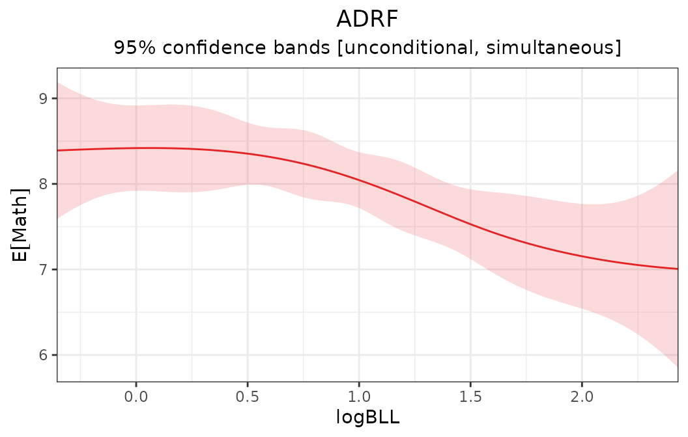

The only option not supported with multiply imputed data is
bootstrapping. Setting `vcov = "boot"` or `vcov = "fwb"` in
[`adrf()`](https://ngreifer.github.io/adrftools/reference/adrf.md) will
yield an error.

#### Using *MatchThem*

To estimate balancing weights in multiply imputed data, we can use
[`MatchThem::weightthem()`](https://rdrr.io/pkg/MatchThem/man/weightthem.html).
All analyses work similarly to when using *mice* alone.

``` r
library(MatchThem)

w_mi <- weightthem(logBLL ~ Male + Age + Race + PIR + Enough_Food +
                    Smoke_in_Home + Smoke_Pregnant + NICU,
                  datasets = imp,
                  method = "glm")

fit_w_mi <- with(w_mi,
                 glm_weightit(Math ~ splines::ns(logBLL, df = 5) *
                                (Age + Male + Race + PIR + Enough_Food + Smoke_in_Home +
                                   Smoke_Pregnant + NICU)))

adrf_w_mi <- adrf(fit_w_mi, treat = "logBLL")

plot(adrf_w_mi)
```

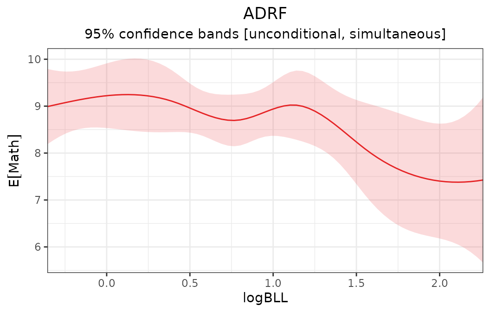

### Bayesian models

All of the described functionality works similarly for Bayesian models
(e.g., those fit with `brms::brm()`,
[`dbarts::bart2()`](https://rdrr.io/pkg/dbarts/man/bart.html), or
`rstanarm::stan_glm()`) as it does for frequentist models. *adrftools*
is a primarily frequentist ecosystem, but special procedures exist for
Bayesian models as well. After fitting a Bayesian outcome model, it can
be supplied to
[`adrf()`](https://ngreifer.github.io/adrftools/reference/adrf.md) as
usual to compute the ADRF. Unlike with frequentist models, the ADRF
posterior is also computed and forms the basis for inference on the
ADRF. All reported estimates are expected *a posteriori* (EAP)
estimates.

When calling
[`adrf()`](https://ngreifer.github.io/adrftools/reference/adrf.md) on a
Bayesian model, `vcov` can be set either to `"none"` to omit the
posterior and just use the EAP estimates or to `"posterior"` to retain
the posterior for inference. Leaving `vcov` unspecified uses
`"posterior"`. Below, we fit a Bayesian additive regression tree (BART)
model using *dbarts*.

``` r
library(dbarts)

bfit <- bart2(Math ~ logBLL + Male + Age + Race +
                PIR + Enough_Food + Smoke_in_Home +
                 Smoke_Pregnant + NICU,
            data = nhanes3lead,
            keepTrees = TRUE, #needed for adrf()
            verbose = FALSE)

adrf_bll_bayes <- adrf(bfit, treat = "logBLL")

adrf_bll_bayes
#> An effect_curve object
#> 
#>  - curve type: ADRF
#>  - response: Math
#>  - treatment: logBLL
#>    + range: -0.3567 to 2.4248
#>  - inference: posterior
#> 
#> Use `plot()` (`?adrftools::plot.effect_curve()`) to plot the curve, `summary()` (`?adrftools::summary.effect_curve()`) to test the curve, or `{object}(values)` (`?adrftools::effect_curve-class()`) to compute estimates.
```

All credible intervals and bands use the confidence interval interface
(e.g., using `conf_level` in
[`summary()`](https://rdrr.io/r/base/summary.html) and
[`plot()`](https://rdrr.io/r/graphics/plot.default.html) to request the
credibility level). The posterior can be treated as a multivariate
normal distribution to compute Wald-based credible intervals by setting
`ci.type = "wald"`, though the default is to use equi-tailed percentile
intervals with `ci.type = "perc"`. Simultaneous inference for
equi-tailed percentile intervals, if requested, uses the Bayesian
algorithm described by Montiel Olea and Plagborg-Møller
([2019](#ref-montielolea2019)), which guarantees uniform credibility
across the whole effect curve. P-values for estimates along the effect
curve are computed as the complement of the smallest credibility level
that excludes the null value.

``` r
plot(adrf_bll_bayes)
```

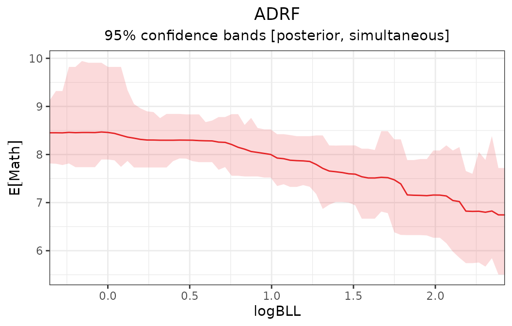

``` r

adrf_bll_bayes(logBLL = c(0, 1, 2)) |>
  summary()
#>         ADRF Estimates
#> ───────────────────────────────
#>  logBLL Estimate CI Low CI High
#>       0    8.466  8.006   9.261
#>       1    7.971  7.591   8.360
#>       2    7.125  6.572   7.785
#> ───────────────────────────────
#> Inference: posterior, simultaneous
#> Confidence level: 95%
```

Omnibus tests for the shape of the line (i.e., by using
[`summary()`](https://rdrr.io/r/base/summary.html) on an `effect_curve`
object) are strictly frequentist and use a shifted version of the
posterior as if it were the sampling distribution of the effect curve
under the null hypothesis.

When Bayesian models are fit to multiply imputed data, the draws of the
ADRF estimates across imputed datasets are pooled to form a single
posterior as described by Zhou and Reiter
([2010](#ref-zhouNoteBayesianInference2010)).

## References

Hansen, Stefan Nygaard, and Morten Overgaard. 2024. “Variance Estimation
for Average Treatment Effects Estimated by g-Computation.” *Metrika*,
April. <https://doi.org/10.1007/s00184-024-00962-4>.

Hill, Jennifer L. 2011. “Bayesian Nonparametric Modeling for Causal
Inference.” *Journal of Computational and Graphical Statistics* 20 (1):
217–40. <https://doi.org/10.1198/jcgs.2010.08162>.

Montiel Olea, José Luis, and Mikkel Plagborg-Møller. 2019. “Simultaneous
Confidence Bands: Theory, Implementation, and an Application to SVARs.”
*Journal of Applied Econometrics* 34 (1): 1–17.
<https://doi.org/10.1002/jae.2656>.

Neugebauer, Romain, and Mark van der Laan. 2007. “Nonparametric Causal
Effects Based on Marginal Structural Models.” *Journal of Statistical
Planning and Inference* 137 (2): 419–34.
<https://doi.org/10.1016/j.jspi.2005.12.008>.

Xu, Li, Chris Gotwalt, Yili Hong, Caleb B. King, and William Q. Meeker.
2020. “Applications of the Fractional-Random-Weight Bootstrap.” *The
American Statistician* 74 (4): 345–58.
<https://doi.org/10.1080/00031305.2020.1731599>.

Zhang, Zhiwei, Jie Zhou, Weihua Cao, and Jun Zhang. 2016. “Causal
Inference with a Quantitative Exposure.” *Statistical Methods in Medical
Research* 25 (1): 315–35. <https://doi.org/10.1177/0962280212452333>.

Zhou, Xiang, and Jerome P. Reiter. 2010. “A Note on Bayesian Inference
After Multiple Imputation.” *The American Statistician* 64 (2): 159–63.
<https://doi.org/10.1198/tast.2010.09109>.

------------------------------------------------------------------------

1.  Note that the confidence bands are symmetrical when a scaling
    corresponding to the transformation is applied to the y-axis; to see
    this, run
    `plot(adrf_bll_bin) + ggplot2::scale_y_continuous(transform = "logit")`

2.  Note that this same procedure be used without actually estimating
    balancing weights by setting `method = NULL` in the call to
    [`weightit()`](https://ngreifer.github.io/WeightIt/reference/weightit.html).
    This yields the same results as the previous two methods.

3.  If, for some reason, you want to include the product of the sampling
    weights and balancing weights in the estimation of the ADRF, set
    `wts = TRUE` instead of leaving it unspecified.
