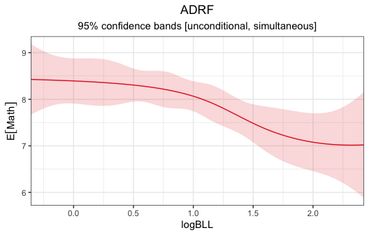
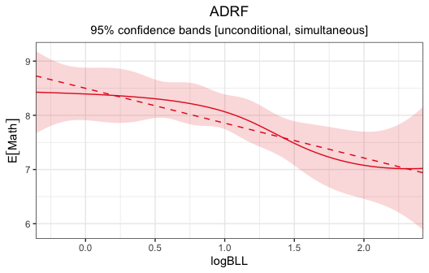

# *adrftools*: Tools for Estimating Average Dose-Response Functions

## 

### Overview

*adrftools* is an R package for estimating the average dose-response
function (ADRF), which characterizes the effect of a continuous
treatment on an outcome. Functionality is included for performing
g-computation on a regression model to estimate the ADRF, plot the ADRF,
and test hypotheses about the ADRF. See
[`vignette("adrftools")`](https://ngreifer.github.io/adrftools/articles/adrftools.md)
for a full tutorial on using *adrftools*.

### Installation

You can install the current stable version of *adrftools* from CRAN
with:

``` r
install.packages("adrftools")
```

You can install the development version of *adrftools* from
[GitHub](https://github.com/ngreifer/adrftools) with:

``` r
# install.packages("pak")
pak::pak("ngreifer/adrftools")
```

### Example

Below we use *adrftools* to estimate and characterize the effect of
blood lead levels on scores on a cognitive test, adjusting for potential
confounders using g-computation.

``` r
library(adrftools)

data("nhanes3lead")
```

Here, the treatment is `logBLL`, the outcome is `Math`, and the
confounders to be adjusted for are `Age`, `Male`, `Race`, `PIR`,
`Enough_Food`, `Smoke_in_Home`, `Smoke_Pregnant`, and `NICU`. We’ll
first fit an outcome model that adjusts for these confounders.

``` r
fit <- lm(Math ~ splines::ns(logBLL, df = 5) * 
            (Age + Race + Male + PIR + Enough_Food +
               Smoke_in_Home + Smoke_Pregnant + NICU),
          data = nhanes3lead)
```

Next we’ll use
[`adrftools::adrf()`](https://ngreifer.github.io/adrftools/reference/adrf.md)
to compute the ADRF.

``` r
adrf_bll <- adrf(fit, treat = "logBLL")

adrf_bll
```

``` R
#> An <effect_curve> object
#> 
#>  - curve type: ADRF
#>  - response: Math
#>  - treatment: logBLL
#>    + range: -0.3567 to 2.4248
#>  - inference: unconditional
```

We can plot the ADRF using
[`plot()`](https://rdrr.io/r/graphics/plot.default.html):

``` r
plot(adrf_bll)
```



By default, this produces simultaneous 95% confidence bands.

`adrf_bll` is an `<effect_curve>` object, which is a function. We can
supply to it values of the treatment to compute the corresponding value
of the ADRF at those treatment values:

``` r
adrf_bll(logBLL = c(0, .5, 1, 1.5, 2))
```

``` R
#>  ADRF Estimates
#> ────────────────
#>  logBLL Estimate
#>     0.0    8.394
#>     0.5    8.305
#>     1.0    8.066
#>     1.5    7.484
#>     2.0    7.078
#> ────────────────
```

We can also produce confidence intervals using
[`summary()`](https://rdrr.io/r/base/summary.html) on the above output:

``` r
adrf_bll(logBLL = c(0, .5, 1, 1.5, 2)) |>
  summary()
```

``` R
#>               ADRF Estimates
#> ──────────────────────────────────────────
#>  logBLL Estimate Std. Error CI Low CI High
#>     0.0    8.394     0.1706  7.959   8.829
#>     0.5    8.305     0.1247  7.987   8.624
#>     1.0    8.066     0.1129  7.778   8.354
#>     1.5    7.484     0.1436  7.117   7.850
#>     2.0    7.078     0.2186  6.520   7.635
#> ──────────────────────────────────────────
#> Inference: unconditional, simultaneous
#> Confidence level: 95% (t* = 2.55, df = 2455)
```

To test an omnibus hypothesis about the ADRF, such as whether it is flat
or linear, we can use [`summary()`](https://rdrr.io/r/base/summary.html)
on the `<effect_curve>` object itself:

``` r
# Test for flatness
summary(adrf_bll, hypothesis = "flat")
```

``` R
#>                   Omnibus Curve Test
#> ───────────────────────────────────────────────────────
#> H₀: ADRF is flat for values of logBLL between -0.3567
#>     and 2.4248
#> 
#>   P-value
#>  < 0.0001
#> ───────────────────────────────────────────────────────
#> Computed using the Imhof approximation
```

``` r
# Test for linearity
summary(adrf_bll, hypothesis = "linear")
```

``` R
#>                   Omnibus Curve Test
#> ───────────────────────────────────────────────────────
#> H₀: ADRF is linear for values of logBLL between
#>     -0.3567 and 2.4248
#> 
#>  P-value
#>   0.3153
#> ───────────────────────────────────────────────────────
#> Computed using the Imhof approximation
```

The results indicate that the ADRF is not flat, but there isn’t enough
evidence to claim it is nonlinear in the range specified. We might
project a linear model onto the ADRF to produce a more interpretable
summary:

``` r
proj <- curve_projection(adrf_bll, model = "linear")
```

Below, we plot the linear projection along with the original ADRF:

``` r
plot(adrf_bll, proj = proj)
```



To examine the coefficient describing the projection, we can use
[`summary()`](https://rdrr.io/r/base/summary.html) on the projection:

``` r
summary(proj)
```

``` R
#>                  ADRF Projection Coefficients
#> ──────────────────────────────────────────────────────────────
#>         Term Estimate Std. Error     t  P-value CI Low CI High
#>  (Intercept)    8.498     0.1329 63.95 < 0.0001  8.237   8.759
#>       logBLL   -0.643     0.1267 -5.07 < 0.0001 -0.891  -0.394
#> ──────────────────────────────────────────────────────────────
#> Inference: unconditional
#> Confidence level: 95% (t* = 1.961, df = 2455)
#> Null value: 0
```

Based on the above, we might conclude the following:

> There is some relationship between `logBLL` and `Math` adjusting for
> the included potential confounders, based on rejection of the
> hypothesis that the ADRF is flat for `logBLL` values between -0.3567
> and 2.4248 (p \< .0001). There isn’t evidence that the ADRF is
> nonlinear within this range (p = .3153). The linear projection has a
> coefficient of -.643 (p \< .0001), indicating that the expected
> potential outcome of `Math` decreases by this amount for each unit
> increase in `logBLL`.

See
[`vignette("adrftools")`](https://ngreifer.github.io/adrftools/articles/adrftools.md)
for more information on how to use *adrftools* and the other features
available.
